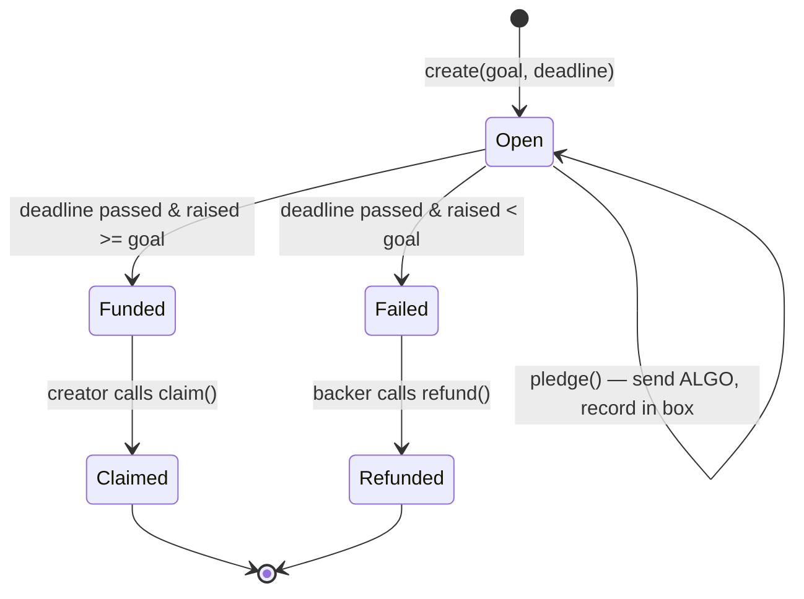

# AlgorArt

A **non-custodial crowdfunding dApp** on the **Algorand** blockchain, for funding creative
projects — books, music, movies, art.

Creators open a campaign with a funding goal and a deadline. Backers pledge real **ALGO**
from their own wallet into an **on-chain escrow contract**. The smart contract — not a
server — holds the funds and enforces the rules: if the goal is met by the deadline, the
creator can claim the funds; if not, every backer can reclaim their pledge.

> Technical details live in [`docs/`](docs/): contract internals, on-chain state,
> design decisions, the [frontend design](docs/frontend.md),
> [the CI plan](docs/ci.md), and the
> [production roadmap](docs/production-roadmap.md) (identity, backend,
> notifications, UI).

## The idea

Crowdfunding is a **trust problem**: you give money to a stranger and hope they deliver.
A blockchain solves this without a middleman:

1. **Funds are locked in a contract**, not in the creator's pocket. Nobody can run off
   with the money mid-campaign.
2. **Rules are code.** *"Raise X by date Y, or everyone gets refunded"* is enforced by
   the network, not by good intentions.
3. **Anyone can verify.** Every pledge, the running total, and the deadline are public
   on-chain state.

Algorand is a natural fit because it is fast, has ~4 second finality, tiny fees
(~0.001 ALGO), and first-class support for exactly this kind of stateful application.

## What "non-custodial" means here

- **Wallet** — the user connects **Pera / Defly** and signs transactions in the browser.
- **Who holds keys** — **only the user**. The app never sees a private key or mnemonic.
- **Source of truth** — **the Algorand chain** (the indexer is just a read model).
- **Logic** — the **smart contract** (AVM), not server code.
- **Escrow** — **funds held by the app account** until the contract's conditions are met.

The app never sees a secret — only signed transactions.

## Contract design

One **stateful Algorand application** per campaign. Funds are held at the app's escrow
address; pledge records live in **boxes** (one per backer).



### ABI methods

| Method | Caller | Conditions | Effect |
| --- | --- | --- | --- |
| `create(title, metadataUri, goal, deadline)` | creator | — | Deploys the app, sets global state |
| `pledge()` | backer | before deadline | Payment tx into escrow; records backer's amount in a box; bumps `raised` |
| `claim()` | creator | after deadline **and** `raised >= goal` | Sends escrow balance to the creator |
| `refund()` | backer | after deadline **and** `raised < goal` | Returns the backer's pledge from escrow |

### Key on-chain state

- **Global:** `creator`, `title`, `metadataUri`, `goal`, `deadline`, `raised`, `status` (`Open` / `Funded` / `Failed` / `Claimed`).
- **Per-backer (boxes):** `amount` pledged.

## Tech stack

| Layer | Technology |
| --- | --- |
| Smart contracts | **Algo TypeScript** (`@algorandfoundation/algorand-typescript`) → AVM |
| Frontend | **React + Vite + TypeScript** |
| Wallet (non-custodial) | **`@txnlab/use-wallet`** → Pera Wallet / Defly |
| SDK / reads | **`algosdk`**, **Algorand Indexer** |
| Testing | **AVM simulator** (`algokit project test`) |
| Tooling | **AlgoKit CLI** + local sandbox (Docker) |
| Backend | **None required** — contract + indexer replace it |

## Project structure (target)

AlgoKit's standard **workspace** layout (what `algokit init` produces and the CLI
expects), with the spec's feature organization inside the frontend.

```text
AlgorArt/
├── projects/
│   ├── contracts/                # AlgoKit contract project (TypeScript)
│   │   └── smart_contracts/
│   │       ├── campaign/         # the escrow app (create/pledge/claim/refund)
│   │       │   ├── contract.algo.ts
│   │       │   ├── contract.algo.spec.ts   # offline AVM tests (Vitest)
│   │       │   └── deploy-config.ts
│   │       └── index.ts          # deploy orchestrator
│   └── frontend/                 # AlgoKit frontend project (React + Vite + TS)
│       └── src/
│           ├── features/
│           │   ├── campaigns/    # create, browse, details
│           │   └── wallet/       # connect button + provider
│           ├── contracts/        # generated typed clients (from ABI)
│           └── lib/              # algod/indexer config
├── README.md
└── .github/                      # branch protection / security config (added manually)
```

## Roadmap

### Phase 0 — Setup

- [x] `algokit init` — AlgoKit workspace (contracts + frontend projects)
- [x] Toolchain: Node.js, Docker Desktop, AlgoKit CLI
- [x] README = this spec
- [x] Local sandbox (algod + indexer in Docker) up and verified
- [x] Lint, format, and type-check tooling wired up (ESLint + Prettier + tsc)

### Phase 1 — Smart contract (core)

- [x] `campaign/contract.algo.ts`: `create`, `pledge`, `claim`, `refund`
- [x] Campaign metadata: on-chain `title` + `metadataUri` (off-chain pointer) on `create()`
- [x] Contract tests: **100% behavioral coverage** — every method × every branch (pledge before/after deadline, claim gating by caller/deadline/goal/double-claim, refund gating by deadline/outcome/backer/double-refund). Offline AVM tests in `contract.algo.spec.ts`; matrix in [`docs/contracts/testing.md`](docs/contracts/testing.md).
- [x] Deploy to localnet, exercise the flow (create → pledge → claim, and → refund) via integration tests in `contract.integration.test.ts`

### Phase 2 — Frontend

The full UI plan — pages, data flow, and the exact `create`/`pledge`/`claim`/
`refund` call patterns — is designed in [`docs/frontend.md`](docs/frontend.md).

- [x] Wallet connect (Pera / Defly) via `use-wallet` (from the AlgoKit starter)
- [x] Campaign list & detail — read global state + boxes via indexer
- [x] Create campaign form → `create()` ABI call
- [x] Pledge flow → `pledge()` ABI call (payment + app call in one group)
- [x] Claim & refund buttons → `claim()` / `refund()` ABI calls
- [x] Unit tests (Vitest) with line coverage ≥ 90% on components & utils

### Phase 3 — TestNet demo

- [ ] Deploy contracts to **TestNet**
- [ ] Deploy the frontend to a static host (any CDN / static file server)
- [ ] Fund a wallet via the TestNet dispenser
- [ ] End-to-end demo: create → pledge → claim (success case) and → refund (failure case)

### Phase 4 — Polish (nice-to-have)

- [ ] Campaign metadata — **on-chain `title` + `metadataUri` implemented**; rich off-chain rendering (IPFS image/description/category) remains Phase 4
- [ ] Cancel-before-deadline option for creators
- [ ] CI: contract simulator tests + frontend build + **coverage gate** + lint/format/type-check gate + markdown lint + frontend image build
  - *In progress*: the consolidated `ci` workflow (build → lint/format/type-check, unit-test, and LocalNet integration) is done; frontend image build remains.
- [ ] Package the frontend as a container image for portable hosting
- [ ] ARC-32/56 spec published for the contract

> **CI.** One consolidated [`build-and-test`](.github/workflows/build-and-test.yml) workflow with four
> jobs (`build` → lint/format/type-check, unit-test, integration-test), plus a
> separate markdown-lint workflow with a `paths:` filter. The `build` job
> compiles the contracts and shares the generated clients/artifacts with the
> downstream jobs. See [the CI plan](docs/ci.md).
>
> **Root `package.json`?** Intentionally absent for now. Markdown linting runs via
> `npx --yes markdownlint-cli2@0.23.2` (version pinned in the command), and the two
> projects manage their own dependencies. If a future need arises for repo-level
> scripts (e.g. a `check-all` convenience wrapper), add a root `package.json` then —
> the markdown lint command can move into it as an `npm run lint:md` script without
> changing the config.

## Getting started

### Prerequisites

- **Node.js LTS** (v20+ for the frontend, v22+ for contracts)
- **Docker Desktop** — only for the LocalNet sandbox (algod + indexer)
- **AlgoKit CLI** — compile contracts, deploy, and manage the local sandbox

That's the whole list. There's no backend, database, or chain node to run — the app is
a static frontend that talks directly to the Algorand network.

### Run it locally

```bash
algokit project bootstrap all    # install deps for contracts/ + frontend/
algokit localnet start           # start algod + indexer in Docker (the "chain")
algokit project run build        # compile contracts + generate typed clients
algokit project run lint         # ESLint across all projects
algokit project run format       # Prettier check across all projects
algokit project run check-types  # type-check across all projects
algokit project run test         # contract unit tests (offline AVM, via Vitest)

npx --yes markdownlint-cli2@0.23.2        # markdownlint across all docs (add --fix to autofix)

cd projects/frontend
npm run dev                      # frontend on http://localhost:5173
```

### Checks

Each project exposes the same three gates, runnable individually or via
`algokit project run <gate>` from the root:

| Gate | What it checks | contracts | frontend |
| --- | --- | --- | --- |
| `lint` | ESLint (bugs, unused vars, import style) | `npm run lint` | `npm run lint` |
| `format` | Prettier (style: quotes, spacing, line width) | `npm run format` | `npm run format` |
| `check-types` | `tsc --noEmit` (type safety) | `npm run check-types` | `npm run check-types` |
| `test` | Offline AVM unit tests (Vitest) | `npm run test` | `npm run test` |
| `test-integration` | LocalNet integration tests (Vitest) | `npm run test:integration` | — |

Markdown is linted separately from the repo root with
`npx --yes markdownlint-cli2@0.23.2`; its rules live in `.markdownlint-cli2.jsonc`.
The version is pinned in the command, so no root `package.json` is needed.

## Testing strategy

The goal is near-total coverage, measured two ways:

- **Smart contract — 100% behavioral coverage.** AVM bytecode has no mature line-coverage
  tool, so coverage is defined by the test matrix: every method × every branch (caller
  checks, deadline checks, goal checks, re-pledge). Each `[success]` / `[failure]` case
  gets an explicit offline AVM test in `contract.algo.spec.ts` (via
  `@algorandfoundation/algorand-typescript-testing` + Vitest), plus a LocalNet
  integration test in `contract.integration.test.ts` that exercises the compiled TEAL
  end-to-end.
- **Frontend — line coverage.** Vitest + `@vitest/coverage-v8` over components and utils
  (`ellipseAddress`, `getAlgoClientConfigs`, feature components). Target ≥ 90%, enforced
  as a CI gate.

## Running in Docker

The only hard Docker requirement is the **LocalNet sandbox** — `algokit localnet start`
runs algod + indexer (+ kmd) as containers. The frontend and contracts themselves are
plain Node projects and run without Docker.

For end users, nothing runs locally at all: once the contract is deployed and the
frontend is served from a static host, the dApp is just a URL in a browser. Packaging
the frontend as a container image is a possible Phase 4 nicety, not a requirement.

## License

Demo project for educational purposes.
