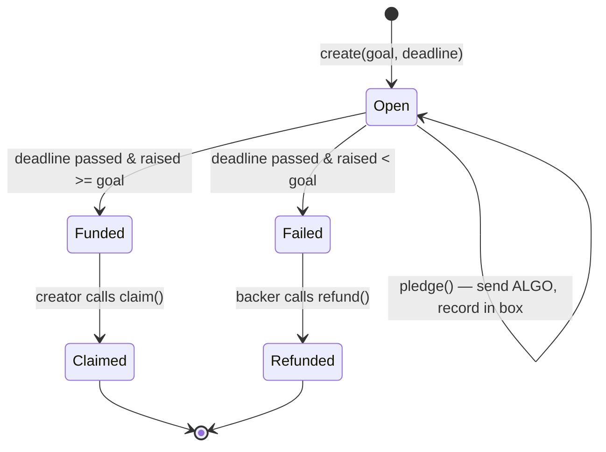

# AlgorArt

A **non-custodial crowdfunding dApp** on the **Algorand** blockchain, for funding creative
projects — books, music, movies, art.

Creators open a campaign with a funding goal and a deadline. Backers pledge real **ALGO**
from their own wallet into an **on-chain escrow contract**. The smart contract — not a
server — holds the funds and enforces the rules: if the goal is met by the deadline, the
creator can claim the funds; if not, every backer can reclaim their pledge.

> **This document is the v2 specification.** The v1 implementation (ASP.NET Core +
> server-side wallets) is kept for reference in the old repo. v2 is a ground-up
> rewrite that turns the idea into a real dApp. See [v1 vs v2](#v1-vs-v2).

## The idea

Crowdfunding is a **trust problem**: you give money to a stranger and hope they deliver.
A blockchain solves this without a middleman:

1. **Funds are locked in a contract**, not in the creator's pocket. Nobody can run off
   with the money mid-campaign.
2. **Rules are code.** *"Raise X by date Y, or everyone gets refunded"* is enforced by
   the network, not by good intentions.
3. **Anyone can verify.** Every pledge, the running total, and the deadline are public
   on-chain state.

Algorand is a natural fit because it is fast, has ~4 second finality, tiny fees
(~0.001 ALGO), and first-class support for exactly this kind of stateful application.

## What "non-custodial" means here

| | v1 (old) | v2 (this) |
|---|---|---|
| Wallet | Server generates an account and stores the **mnemonic** in the DB | User connects **Pera / Defly** and signs in the browser |
| Who holds keys | The app | **Only the user** |
| Source of truth | SQLite database | **The Algorand chain** (indexer is just a read model) |
| Logic | C# controller code | **Smart contract** (AVM) |
| Escrow | Direct payment to the creator | **Funds held by the app account** until conditions are met |

The server holding private keys was the single biggest architectural flaw in v1. v2
removes it entirely — the app never sees a secret, only signed transactions.

## Contract design

One **stateful Algorand application** per campaign. Funds are held at the app's escrow
address; pledge records live in **boxes** (one per backer).



**ABI methods**

| Method | Caller | Conditions | Effect |
|---|---|---|---|
| `create(goal, deadline)` | creator | — | Deploys the app, sets global state |
| `pledge()` | backer | before deadline | Payment tx into escrow; records backer's amount in a box; bumps `raised` |
| `claim()` | creator | after deadline **and** `raised >= goal` | Sends escrow balance to the creator |
| `refund()` | backer | after deadline **and** `raised < goal` | Returns the backer's pledge from escrow |

**Key on-chain state**

- **Global:** `creator`, `goal`, `deadline`, `raised`, `status` (`Open` / `Funded` / `Failed` / `Claimed`).
- **Per-backer (boxes):** `amount` pledged.

## Tech stack

| Layer | Technology |
|---|---|
| Smart contracts | **Algo TypeScript** (`@algorandfoundation/algorand-typescript`) → AVM |
| Frontend | **React + Vite + TypeScript** |
| Wallet (non-custodial) | **`@txnlab/use-wallet`** → Pera Wallet / Defly |
| SDK / reads | **`algosdk`**, **Algorand Indexer** |
| Testing | **AVM simulator** (`algokit project test`) |
| Tooling | **AlgoKit CLI** + local sandbox (Docker) |
| Backend | **None required** — contract + indexer replace it |

## Project structure (target)

AlgoKit's standard **workspace** layout (what `algokit init` produces and the CLI
expects), with the spec's feature organization inside the frontend.

```
AlgorArt/
├── projects/
│   ├── contracts/                # AlgoKit contract project (TypeScript)
│   │   └── smart_contracts/
│   │       ├── campaign/         # the escrow app (create/pledge/claim/refund)
│   │       │   ├── contract.algo.ts
│   │       │   ├── contract.spec.ts   # simulator tests
│   │       │   └── deploy-config.ts
│   │       └── index.ts          # deploy orchestrator
│   └── frontend/                 # AlgoKit frontend project (React + Vite + TS)
│       └── src/
│           ├── features/
│           │   ├── campaigns/    # create, browse, details
│           │   └── wallet/       # connect button + provider
│           ├── contracts/        # generated typed clients (from ABI)
│           └── lib/              # algod/indexer config
├── README.md
└── .github/                      # branch protection / security config (added manually)
```

## Roadmap

### Phase 0 — Setup
- [x] `algokit init` — AlgoKit workspace (contracts + frontend projects)
- [x] Toolchain: Node.js, Docker Desktop, AlgoKit CLI
- [x] README = this spec
- [ ] Local sandbox (algod + indexer in Docker) up and verified

### Phase 1 — Smart contract (core)
- [ ] `campaign/contract.algo.ts`: `create`, `pledge`, `claim`, `refund`
- [ ] Simulator tests covering: pledge before/after deadline, claim gating, refund gating
- [ ] Deploy to localnet, exercise the flow with `goal` / AlgoKit

### Phase 2 — Frontend
- [ ] Wallet connect (Pera / Defly) via `use-wallet`
- [ ] Create campaign form → `create()` ABI call
- [ ] Campaign list & detail (read via indexer + generated client)
- [ ] Pledge flow (sign payment + app call), claim, refund buttons

### Phase 3 — TestNet demo
- [ ] Deploy contracts to **TestNet**
- [ ] Fund a wallet via the TestNet dispenser
- [ ] End-to-end demo: create → pledge → claim (success case) and → refund (failure case)

### Phase 4 — Polish (nice-to-have)
- [ ] Campaign images/metadata on **IPFS** (or Algorand's metadata standard)
- [ ] Cancel-before-deadline option for creators
- [ ] CI: contract tests + frontend build
- [ ] ARC-32/56 spec published for the contract

## Getting started

> Prerequisites: Node.js LTS, Docker Desktop, and AlgoKit CLI.

```bash
algokit project bootstrap all    # install deps for contracts/ + frontend/
algokit localnet start           # start algod + indexer in Docker
algokit project run build        # compile contracts + generate clients
algokit project test             # run contract simulator tests
```

## v1 vs v2

The original v1 (ASP.NET Core, EF Core/SQLite, server-side Algorand accounts) was a
useful learning step, but architecturally it was a centralized app with a payment
attached. v2 keeps the **same idea** — crowdfunding creative work on Algorand — but
rebuilds it the way a dApp should be built: **non-custodial wallets, on-chain state,
and a smart contract as the source of truth.**

## License

Demo project for educational purposes.