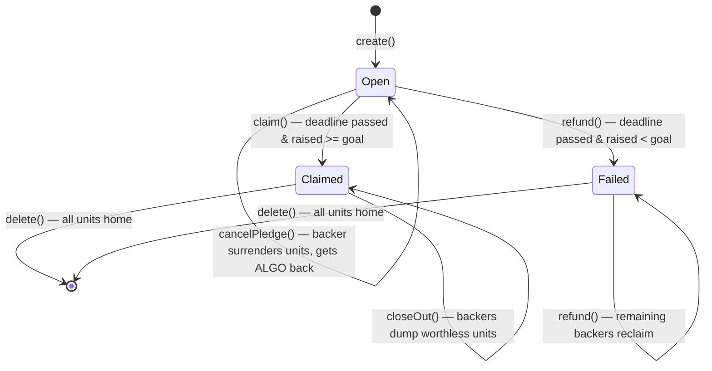

# AlgorArt

A **non-custodial crowdfunding dApp** on the **Algorand** blockchain, for funding creative
projects — books, music, movies, art.

Creators open a campaign with a funding goal and a deadline. Backers pledge real **ALGO**
from their own wallet into an **on-chain escrow contract**. The smart contract — not a
server — holds the funds and enforces the rules: if the goal is met by the deadline, the
creator can claim the funds; if not, every backer can reclaim their pledge.

> Technical details live in [`docs/`](docs/): contract internals in
> [the contract docs](docs/campaign.md) and the
> [Claim ASA redesign rationale](docs/claim-asa-redesign.md), the
> [frontend design](docs/frontend.md), the [Factory & architecture](docs/architecture.md),
> [the CI plan](docs/ci.md), the [roadmap](docs/roadmap.md) (what's left to do),
> and [product design & open questions](docs/design.md).

## The idea

Crowdfunding is a **trust problem**: you give money to a stranger and hope they deliver.
A blockchain solves this without a middleman:

1. **Funds are locked in a contract**, not in the creator's pocket. Nobody can run off
   with the money mid-campaign.
2. **Rules are code.** *"Raise X by date Y, or everyone gets refunded"* is enforced by
   the network, not by good intentions.
3. **Anyone can verify.** Every pledge, the running total, and the deadline are public
   on-chain state.

Algorand is a natural fit because it is fast, has ~4 second finality, tiny fees
(~0.001 ALGO), and first-class support for exactly this kind of stateful application.

## What "non-custodial" means here

- **Wallet** — the user connects **Pera / Defly** and signs transactions in the browser.
- **Who holds keys** — **only the user**. The app never sees a private key or mnemonic.
- **Source of truth** — **the Algorand chain** (the indexer is just a read model).
- **Logic** — the **smart contract** (AVM), not server code.
- **Escrow** — **funds held by the app account** until the contract's conditions are met.

The app never sees a secret — only signed transactions.

## Contract design

One **stateful Algorand application** per campaign, plus a per-campaign **Claim ASA**.
Funds are held at the app's escrow address; a backer's refundable claim is their
**balance of the Claim ASA** — 1 unit = 1 microAlgo. Refunding surrenders the units
back to the escrow, so the same claim cannot be redeemed twice. A separate **Factory**
registry app proves which campaigns are official AlgorArt.



### ABI methods

| Method | Caller | Conditions | Effect |
| --- | --- | --- | --- |
| `create(title, metadataUri, goal, deadline)` | creator | — | Deploys the app, sets global state |
| `fund()` | creator | once, ≥ 0.2 ALGO | Funds the escrow's fixed MBR; issues the Claim ASA |
| `pledge()` | backer | before deadline, opted in | Payment tx into escrow; mints equal claim units; bumps `raised` |
| `claim()` | creator | after deadline **and** `raised >= goal` | Sends the spendable escrow balance to the creator |
| `refund()` | backer | after deadline **and** `raised < goal` | Surrenders claim units; pays the same µA back |
| `cancelPledge()` | backer | before deadline | Surrenders claim units; pays back; decrements `raised` |
| `closeOut()` | backer | claimed | Returns worthless units; frees the backer's opt-in MBR |
| `delete()` | creator | settled & no outstanding units | Destroys the Claim ASA, closes the escrow, frees all MBR |

### Key on-chain state

- **Global (per campaign):** `creator`, `title`, `metadataUri`, `goal`, `deadline`,
  `raised`, `status` (`Open` / `Failed` / `Claimed`), `claimAsa`, `deposit`.
- **Per backer:** nothing on the campaign — the backer's Claim ASA balance *is* their pledge.
- **Factory (one app):** `owner`, the official Campaign approval-program hash,
  `registered` boxes (app id → creator).

## Tech stack

| Layer | Technology |
| --- | --- |
| Smart contracts | **Algo TypeScript** (`@algorandfoundation/algorand-typescript`) → AVM |
| Frontend | **React + Vite + TypeScript** |
| Wallet (non-custodial) | **`@txnlab/use-wallet`** → Pera Wallet / Defly |
| SDK / reads | **`algosdk`**, **Algorand Indexer** |
| Testing | **AVM simulator** (offline) + **LocalNet** integration (Vitest) |
| Tooling | **AlgoKit CLI** + local sandbox (Docker) |
| Backend | **None required** — contract + indexer + Factory replace it |

## Project structure (target)

AlgoKit's standard **workspace** layout (what `algokit init` produces and the CLI
expects), with the spec's feature organization inside the frontend.

```text
AlgorArt/
├── projects/
│   ├── contracts/                # AlgoKit contract project (TypeScript)
│   │   └── smart_contracts/
│   │       ├── campaign/         # the escrow app + Claim ASA (create/fund/pledge/claim/refund)
│   │       │   ├── contract.algo.ts
│   │       │   ├── contract.algo.spec.ts   # offline AVM tests (Vitest)
│   │       │   └── deploy-config.ts
│   │       ├── factory/          # the canonical campaign registry
│   │       │   ├── contract.algo.ts
│   │       │   └── deploy-config.ts
│   │       └── index.ts          # deploy orchestrator
│   └── frontend/                 # AlgoKit frontend project (React + Vite + TS)
│       └── src/
│           ├── features/
│           │   ├── campaigns/    # create, browse, details
│           │   └── wallet/       # connect button + provider
│           ├── contracts/        # generated typed clients (from ABI)
│           └── lib/              # algod/indexer config + campaign/transaction helpers
├── README.md
└── .github/                      # branch protection / security config (added manually)
```

## Roadmap

Two docs carry the plan:

- [`docs/roadmap.md`](docs/roadmap.md) — a living checklist of what's left, organized by area.
- [`docs/design.md`](docs/design.md) — product design & open questions (identity, backend, notifications, UI).

Done so far: setup; the core contract (`create`/`fund`/`pledge`/`claim`/`refund` with full
tests); the Claim ASA redesign (replacing the Merkle/spent-bitmap machinery) and the
Factory registry; and the core frontend (wallet connect, browse, create, pledge,
claim/refund/cancel, close-out, delete).
Next up: a TestNet smoke test, the contract-shape decisions (`updateMetadata`),
then styling and the later product features.

> **CI.** One consolidated [`build-and-test`](.github/workflows/build-and-test.yml) workflow with four
> jobs (`build` → lint/format/type-check, unit-test, integration-test), plus a
> separate markdown-lint workflow with a `paths:` filter. The `build` job
> compiles the contracts and shares the generated clients/artifacts with the
> downstream jobs. See [the CI plan](docs/ci.md).
>
> **Root `package.json`?** Intentionally absent for now. Markdown linting runs via
> `npx --yes markdownlint-cli2@0.23.2` (version pinned in the command), and the two
> projects manage their own dependencies. If a future need arises for repo-level
> scripts (e.g. a `check-all` convenience wrapper), add a root `package.json` then —
> the markdown lint command can move into it as an `npm run lint:md` script without
> changing the config.

## Getting started

### Prerequisites

- **Node.js LTS** (v20+ for the frontend, v22+ for contracts)
- **Docker Desktop** — only for the LocalNet sandbox (algod + indexer)
- **AlgoKit CLI** — compile contracts, deploy, and manage the local sandbox

That's the whole list. There's no backend, database, or chain node to run — the app is
a static frontend that talks directly to the Algorand network.

### Run it locally

```bash
algokit project bootstrap all    # install deps for contracts/ + frontend/
algokit localnet start           # start algod + indexer in Docker (the "chain")
algokit project run build        # compile contracts + generate typed clients

cd projects/contracts
npm run deploy:ci -- factory     # deploy the Factory (prints the app id)
npm run deploy:ci -- campaign    # optional demo campaign
FACTORY_APP_ID=<factory app id> npx ts-node --transpile-only scripts/seed-demo.ts  # demo data

cd ../frontend
# set VITE_FACTORY_APP_ID=<factory app id> in .env
npm run dev                      # frontend on http://localhost:5173

algokit project run lint         # ESLint across all projects
algokit project run format       # Prettier check across all projects
algokit project run check-types  # type-check across all projects
algokit project run test         # contract unit tests (offline AVM, via Vitest)

npx --yes markdownlint-cli2@0.23.2        # markdownlint across all docs (add --fix to autofix)
```

### Checks

Each project exposes the same three gates, runnable individually or via
`algokit project run <gate>` from the root:

| Gate | What it checks | contracts | frontend |
| --- | --- | --- | --- |
| `lint` | ESLint (bugs, unused vars, import style) | `npm run lint` | `npm run lint` |
| `format` | Prettier (style: quotes, spacing, line width) | `npm run format` | `npm run format` |
| `check-types` | `tsc --noEmit` (type safety) | `npm run check-types` | `npm run check-types` |
| `test` | Offline AVM unit tests (Vitest) | `npm run test` | `npm run test` |
| `test-integration` | LocalNet integration tests (Vitest) | `npm run test:integration` | — |

Markdown is linted separately from the repo root with
`npx --yes markdownlint-cli2@0.23.2`; its rules live in `.markdownlint-cli2.jsonc`.
The version is pinned in the command, so no root `package.json` is needed.

## Testing strategy

The goal is near-total coverage, measured two ways:

- **Smart contract — 100% behavioral coverage.** AVM bytecode has no mature line-coverage
  tool, so coverage is defined by the test matrix: every method × every branch (caller
  checks, deadline checks, goal checks, surrender validation, re-pledge). Each case gets
  an explicit offline AVM test in `contract.algo.spec.ts` / `factory/contract.algo.spec.ts`
  (via `algorand-typescript-testing` + Vitest), plus LocalNet integration tests
  (`*.integration.test.ts`) that exercise the compiled TEAL end-to-end with real balances
  and MBR assertions.
- **Frontend — line coverage.** Vitest + `@vitest/coverage-v8` over components and utils
  (`ellipseAddress`, `getAlgoClientConfigs`, feature components). Target ≥ 90%, enforced
  as a CI gate.

## Running in Docker

The only hard Docker requirement is the **LocalNet sandbox** — `algokit localnet start`
runs algod + indexer (+ kmd) as containers. The frontend and contracts themselves are
plain Node projects and run without Docker.

For end users, nothing runs locally at all: once the contracts are deployed and the
frontend is served from a static host, the dApp is just a URL in a browser. Packaging
the frontend as a container image is a possible later nicety, not a requirement.

## License

Demo project for educational purposes.
