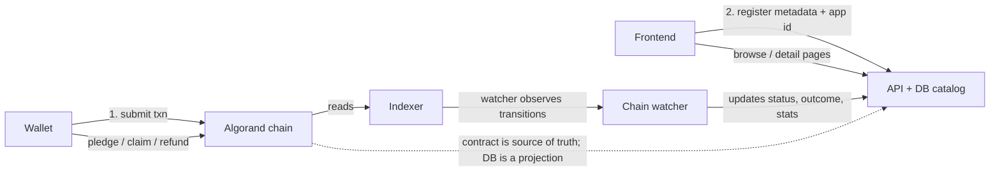

# Architecture

How AlgorArt moves from "a contract that works" to "a Kickstarter that does not
lose its history". This doc explains the split between the **escrow** and the
**catalog**, and why a minimal backend is the right call for discovery and
archival. It is a design plan, not implemented code.

> Contract internals: [`campaign.md`](campaign.md). Frontend design:
> [`frontend.md`](frontend.md). Product design & open questions:
> [`design.md`](design.md). Roadmap: [`roadmap.md`](roadmap.md).

## The core split: escrow vs record

Today one Algorand application plays two roles, and that coupling is what makes
"how do we keep ended campaigns?" feel uncomfortable:

| | The escrow | The campaign record |
| --- | --- | --- |
| What it is | Pledged ALGO + enforcement rules | Title, story, image, goal, deadline, outcome, stats, history |
| Where it lives today | On-chain (app + boxes) | On-chain (title/global state) + off-chain (IPFS metadata) |
| Lifecycle | Temporary — should be swept after settlement | Permanent — must outlive settlement |

Once those are separated, the answer is clean: **the escrow can be deleted and
swept, because the record lives elsewhere.**

## The hidden problem: discovery, not just archival

Even ignoring deletion, a Kickstarter-style browse page is hard on a pure
indexer. The Algorand indexer is keyed by **account** and **app id**. There is no
cheap "list every app whose approval program is X" query.

So "show all campaigns" requires either:

- a **registry app** on-chain (a singleton whose state lists every campaign's app
  id), or
- an **off-chain catalog** (a database the frontend writes to at creation).

And search/filter/sort ("art", "games", "ending soon", "most funded") cannot be
done by the indexer at all — it is not a text-search or analytics engine.
Kickstarter's browse experience needs a real query layer.

**The catalog is the real reason a backend exists. Archival is a consequence of
having one.**

## Recommended architecture

Four pieces:

1. **Contract** — unchanged in role: holds funds, enforces the outcome. It is the
   *escrow*, not the record. (It can then freely add `delete()` to sweep residue,
   because nothing depends on the app surviving.)
2. **Indexer** — live read model for on-chain truth (balances, boxes, status), as
   today.
3. **Minimal backend (API + DB)** — the **catalog**: a `campaigns` table with app
   id, creator, title, metadata/IPFS URI, goal, deadline, status, outcome, raised,
   backer count, timestamps. Serves browse/detail/history pages forever.
4. **Chain watcher** — a small service that observes the indexer (polling, or a
   hosted-indexer webhook) and updates the DB when campaigns are created, pledged,
   claimed, refunded, or deleted. The DB is a **projection**; the chain is
   authoritative and the DB is rebuildable by re-syncing.

### Creation flow

1. Frontend signs + submits the `create()` transaction.
2. Gets back the app id + escrow address.
3. POSTs `{ appId, creator, title, metadataUri, goal, deadline }` to the API.
4. The API validates against the indexer that the app exists and the creator
   matches (prevents junk/forged listings).
5. The watcher later confirms `status` transitions and finalizes the record.

## Why this is the right call

- **Ended campaigns live forever**, with full metadata, even after the app is
  deleted and residue swept.
- **Discovery** (browse all, filter, sort, paginate, search) becomes a real query,
  not indexer gymnastics.
- **Rich detail pages** for ended campaigns — backer counts, funding timeline,
  outcome — stored once at finalization.
- **Notifications later** slot into the same watcher (design.md already says this
  is the one feature that needs a backend).
- **Contract can recover residue** — the delete tension disappears.

## Archived vs live data (the verified caveat)

What the chain and indexer actually retain after an app is deleted, per the
official Algorand docs:

- A deleted application is **not erased** from the indexer. Lookups still return
  the app with a `deleted` flag and `deleted-at-round`, and `include-all` includes
  deleted applications.
- A deleted app's **global state remains queryable** via the indexer.
- **Boxes are not deleted when the app is deleted.** They become non-modifiable
  but remain queryable, and their minimum balance stays **locked** on the account
  forever. The only way to recover box MBR is to delete each box before deleting
  the app (see [`campaign.md`](campaign.md)).

So indexer history alone is *mostly* survivable for global state, but the
per-backer pledge data (boxes) is exactly what becomes non-modifiable dead data.
This is why the catalog should **snapshot the outcome while the boxes still
exist**, then let the chain forget. Archiving into our own DB at the moment of
finalization is safer than relying on indexer history.

## Lighter alternatives, if no backend yet

| Option | Ended-campaign story | Discovery | Residue recovery |
| --- | --- | --- | --- |
| Pure on-chain, never delete (today) | Indexer keeps live apps | Needs a registry app; no search | Stranded |
| Registry app + keep alive | Registry lists app ids; indexer serves state | Registry solves listing, not search | Stranded |
| **Minimal backend (recommended)** | DB catalog + archived snapshot | Real queries | `delete()` works, record survives |

## Scope of the minimal backend

Keep it tiny: one table, two read endpoints (create-listing, list/detail), one
watcher loop. It is a **catalog + archive**, never a second source of truth. It
holds no keys and no funds, and it never decides outcomes — those remain on-chain.
This aligns with what [`design.md`](design.md) already anticipates: a minimal
backend arrives with notifications and profiles; archival and discovery are
earlier, stronger reasons for it.

## References

Official Algorand docs backing the claims in this file (verify against these
when in doubt):

- [Box Storage](https://dev.algorand.co/concepts/smart-contracts/storage/box/) —
  "If an app is deleted, its boxes are not deleted" and box MBR is locked.
- [Indexer REST API](https://dev.algorand.co/reference/rest-api/indexer/) —
  application `deleted` / `deleted-at-round` fields, `include-all`, box lookup
  endpoints.
- [Applications](https://dev.algorand.co/concepts/smart-contracts/apps/) — app
  lifecycle and deletion.
- [Transaction Types](https://dev.algorand.co/concepts/transactions/types/) —
  application call transactions, including `DeleteApplication`.
