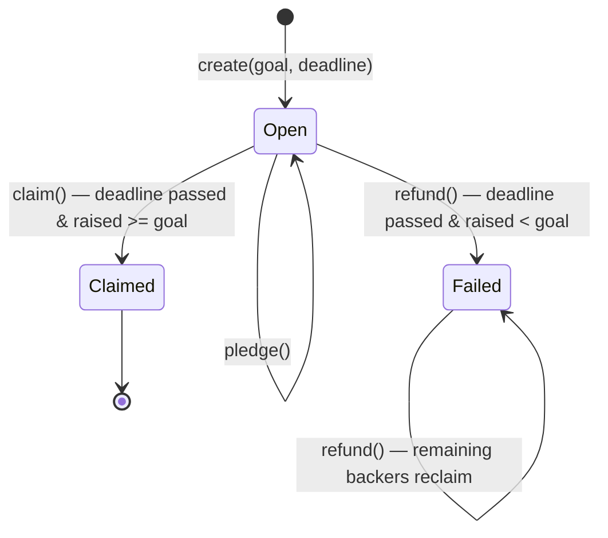

# Campaign contract

The `Campaign` contract (`smart_contracts/campaign/contract.algo.ts`) is the core of
AlgorArt: a non-custodial crowdfunding escrow. One stateful application per campaign.

Source of truth is the Algorand chain. The contract — not a server — holds pledged ALGO
and enforces the campaign rules.

## Contract vs application

**Contract** = the code: `contract.algo.ts`, compiled into TEAL approval/clear
programs. **Application** = one deployed instance of that code, with an app ID,
global state, boxes, and an associated **app account** (the escrow) that holds
ALGO.

Deployment is a single `create()` app-create transaction that uploads the TEAL and
instantiates one campaign atomically — there is no separate "deploy the code" step,
and the only applications that exist are campaigns. The compiled programs live in
`smart_contracts/artifacts/campaign/` (`Campaign.approval.teal`,
`Campaign.clear.teal`) and are embedded in the app-create transaction, so they end
up stored and executed on-chain. The ARC-32/56 specs and the generated client are
tooling-only and never go on-chain.

## State

### Global state

| Key | Type | Meaning |
| --- | --- | --- |
| `creator` | `Account` | Campaign creator; the only account allowed to `claim()` |
| `title` | `bytes` | Short campaign title, fixed at `create()` |
| `metadataUri` | `bytes` | URI of off-chain campaign metadata (ARC-3-style JSON blob) |
| `goal` | `uint64` | Funding target, in microAlgos |
| `deadline` | `uint64` | UNIX timestamp (seconds) after which the outcome is decided |
| `raised` | `uint64` | Total microAlgos pledged so far |
| `status` | `uint64` | `0` Open, `1` Failed, `2` Claimed |

### Boxes

| Map | Key | Value | Meaning |
| --- | --- | --- | --- |
| `pledges` | backer address | `uint64` | That backer's pledged microAlgos |

## State machine

## Settlement is pull-based

Nothing runs automatically on Algorand: smart contracts execute only when someone
submits a transaction. The `deadline` is a timestamp **guard**, not a trigger —
there is no cron, scheduler, or "at deadline, settle" event.

- **Successful campaign:** the deadline passes and nothing happens. The creator (or
  anyone, if `claim()` were made permissionless) must call `claim()` for the payout
  to execute.
- **Failed campaign:** the deadline passes and nothing happens. Each backer must
  call `refund()` to reclaim their pledge, or someone sweeps with `refundBatch()`
  until the escrow is drained. Until a refund is called, the pledge sits in the
  escrow indefinitely.
- **Creator seed:** the base minimum balance (0.1 ALGO + global-state bytes) is
  recovered by deleting the app; each backer's box MBR is recovered only by
  deleting that box. Neither is automatic, and no such method exists yet.

Every movement of funds (claim, refund, sweep, delete) is therefore an explicit
transaction submitted by a caller; none of it is automatic.

## Methods & guards

### `create(title, metadataUri, goal, deadline)`

- `@abimethod({ onCreate: 'require' })` — only runs in the app-create transaction.
- Guards: must be app-create (`applicationId == 0`), `title` non-empty, `title` and
  `metadataUri` at most 128 bytes each (the AVM cap for a bytes global-state value),
  `goal > 0`, deadline in the future.
- Sets `creator`, `title`, `metadataUri`, `goal`, `deadline`, `raised = 0`, `status = Open`.
- `title` is immutable; `metadataUri` is an off-chain pointer (description/image/category).

### `pledge(payment)`

- Takes a `gtxn.PaymentTxn` — the caller submits this app call in a group with a payment
  from their own account to the app's escrow address.
- Guards:
  - before the deadline (`Global.latestTimestamp < deadline`)
  - `payment.receiver == Global.currentApplicationAddress` (escrow)
  - `payment.sender == Txn.sender` (payer is the caller)
  - `payment.amount > 0`
  - `Txn.sender != creator` (a creator cannot pledge to their own campaign)
- Adds `payment.amount` to the backer's box and to `raised`.
- **Re-pledging is allowed** — each payment is added to the existing box total.

### `claim()`

- Creator only (`Txn.sender == creator`), after the deadline, and `raised >= goal`.
- Guards: `status == Open` (prevents double payout).
- Sets `status = Claimed`, then pays `balance − minBalance` (the spendable amount)
  to the creator — the minimum balance stays in the escrow (see Boxes & minimum balance).

### `refund()`

- Any backer, after the deadline, and `raised < goal`.
- Materialises `status = Failed` on the first refund; subsequent calls require it.
- Guard: the caller's pledge box must exist (prevents refunding twice or refunding non-backers).
- Deletes the box and pays the box amount back to the caller. The backer pays the
  fees (app call + one inner payment ≈ 0.002 ALGO); the refund amount is never reduced.

### `cancelPledge()`

> **Proposed** — documented for design alignment; not yet implemented.

- Backer only (`Txn.sender` must have a pledge box), **before** the deadline, while
  the campaign is still `Open`.
- Deletes the caller's pledge box, pays the box amount back to the caller, and
  decrements `raised` by that amount.
- The box delete makes a second cancel impossible (same pattern as `refund`); the
  backer pays ≈ 0.002 ALGO (app call + one inner payment).
- **Trade-off:** while `Open`, `raised` becomes a live, revocable number. A large
  backer can pledge to make a campaign look near-funded, then withdraw just before
  the deadline. This mirrors the creator self-pledge concern (design decision 7)
  but from the backer side, and the deadline remains the sole arbiter of the
  outcome — accepted for a non-custodial demo.

### `refundBatch(backers...)`

> **Proposed** — documented for design alignment; not yet implemented.

- Refunds up to 8 backers in a single call (the AVM box-reference limit), one
  inner payment per backer, deleting each pledge box.
- **Callable by anyone** after the deadline when `raised < goal` — the sweep is
  permissionless, so closure does not depend on the creator returning.
- The outer app-call fee must cover the app call plus one minimum fee per inner
  payment: ≈ 0.009 ALGO for a full batch of 8. Refund amounts are never reduced
  by fees; the caller pays.

### `delete()`

> **Proposed** — documented for design alignment; not yet implemented.

- **Callable by anyone** after `status == Claimed` — recovers the residue that
  `claim()` leaves behind.
- **Two kinds of residue, two mechanisms.** The creator's seeded **base minimum
  balance** (0.1 ALGO + global-state bytes) is released by deleting the
  application. Each backer's **box MBR** (~0.0185 ALGO) is released only when
  that box is deleted — deleting the app alone does **not** delete its boxes, and
  a deleted app with outstanding boxes leaves their MBR permanently locked (AVM
  box rules).
- **Correct cleanup order.** The method must first delete pledge boxes (batched,
  ≤ 8 per call, same box-reference limit as `refundBatch`) and only then submit
  the application delete. Box names are read off-chain from the indexer, so the
  sweep can be permissionless; the destination of recovered ALGO is fixed by the
  contract, so no one can divert funds.
- **Claim cannot be replaced by a bare delete.** Deleting the app pays out only
  the base minimum balance — it does not sweep box MBR — so the current
  `balance − minBalance` claim payout and a box sweep are complementary, not
  alternatives.
- **On a failed campaign, delete must be guarded.** The app can only be deleted
  once every pledge box is gone (all refunds done); otherwise a delete would close
  the app with un-refunded pledges still locked inside it. Because the contract
  cannot enumerate boxes, this needs an explicit backer counter (increment on
  first pledge, decrement on refund) that must read zero before deleting.
- **Trade-off:** deleting the app freezes the on-chain record (`status`, `title`,
  pledge boxes) as non-modifiable. The indexer still returns the app with a
  `deleted` flag and its boxes remain queryable, but the UI must treat a deleted
  campaign as "claimed, and settled".

## Boxes & minimum balance

A **box** is named key–value storage attached to an application. Each backer gets
one box — keyed by their address, holding their pledged microAlgos — the `pledges`
map described above. Boxes differ from global state in two ways that matter here:

- A box value can be up to 32 KB, versus the 128-byte cap on a global-state value,
  so boxes hold per-backer data for an unbounded number of backers.
- **Every box increases the app account's minimum balance requirement (MBR).**

### Minimum balance

Every Algorand account must keep a minimum balance or the network treats it as
closed. For an app account the minimum is the network-wide base (0.1 ALGO) plus a
storage cost that grows with what the app stores: its global-state bytes and every
box it holds. The consensus formula for one pledge box (32-byte key + 8-byte
value):

$$ 2500 + 400 \times (\text{key bytes} + \text{value bytes}) = 18{,}500\ \mu\text{ALGO} \approx 0.0185\ \text{ALGO} $$

A campaign with 500 backers therefore locks ≈ 9.25 ALGO of MBR just to hold the
pledge boxes.

### Who pays for it

The creator seeds the escrow once at `create()`: the app-create transaction funds
the base minimum balance plus the global-state bytes (roughly a few tenths of an
ALGO). Future box MBR is **not** paid by the creator — each backer funds their own
box atomically:

1. A backer pledges ALGO to the escrow and creates their box in the **same
   transaction group**.
2. The box raises `minBalance` by ≈ 0.0185 ALGO at the same moment the balance
   rises by the full pledge amount.

So no upfront hoard is needed, but there is a **minimum first pledge**: a first
pledge smaller than the box's MBR is rejected, because the account can't afford a
box it just created. Re-pledges can be arbitrarily small, since they add to an
existing box and don't change MBR.

The protocol guarantees `balance >= minBalance` at all times by rejecting any
transaction that would leave an account below its minimum — so an underfunded
escrow is impossible; tiny pledges simply fail instead.

### The cost is real, and currently unrecoverable

Box MBR is not a fee — it is ALGO locked in the escrow for as long as the box
exists. Consequences:

- `claim()` pays `balance − minBalance`, so the creator receives roughly
  **0.0185 ALGO per backer less** than the total pledged. With 100 backers
  pledging 1 ALGO each, the creator gets ≈ 98 ALGO; the rest (box MBR ≈ 1.85 ALGO
  plus the base minimum) stays locked.
- Deleting a box frees its MBR back into the spendable balance — `refund()` (and
  the proposed `cancelPledge()`) rely on this.
- The current contract has **no way to recover the residue after a successful
  claim**: `claim()` leaves the boxes behind (known edge case 7) and there is no
  cleanup method. Recovering it needs both a box sweep (delete each pledge box)
  and an application delete; the proposed `delete()` method covers both.

## Design decisions

1. **`Funded` is a derived state.** There is no separate `settle()` call, so
   `claim()`/`refund()` evaluate the deadline and goal directly. `Funded` is never
   materialised into global state; only `Open`, `Failed`, and `Claimed` are stored.
2. **Escrow payout is `balance − minBalance`.** The app account must keep its minimum
   balance to remain alive, so the contract only ever pays out the spendable amount.
3. **First pledge uses `Box.get({ default: 0 })`.** Reading a missing box's `.value` would
   fail the transaction, so the first pledge defaults to 0.
4. **Re-pledging accumulates.** A backer's box holds the running total of all their
   payments; no separate pledge counter.
5. **Refund deletes the box after reading it.** This makes a second refund impossible
   (box no longer exists) and is safe because the payment is issued in the same transaction.
6. **`claim()` guards against re-entrancy/replay** with the `already claimed` status check.
7. **Creators cannot self-pledge.** `pledge()` rejects `Txn.sender == creator`. A self-pledge is not a direct
   funds leak (the creator would only move their own ALGO in and out), but it lets a creator fabricate the
   `raised` number to make a campaign look funded — undermining the trust story the contract exists to provide.
8. **Refund sweep is permissionless (proposed).** `refundBatch` is callable by any account, not just the
   creator, so a failed campaign can be fully drained even if the creator never returns. Whoever calls pays the
   batch fee; refund amounts are never reduced.
9. **Pledges are cancellable before the deadline (proposed).** `cancelPledge` lets a backer withdraw while the
   campaign is still `Open`, mirroring Kickstarter's "not charged until the deadline" model. It reintroduces the
   revocable-`raised` concern the self-pledge ban guards against, but the deadline remains the sole arbiter of the
   outcome — accepted for a non-custodial demo.
10. **Claim residue is recoverable only via box deletion + app delete (proposed).** `claim()` deliberately keeps
    the app alive so the campaign record stays readable, but that strands the creator's seeded base minimum balance
    and every backer's box MBR on-chain. A permissionless `delete()` after `Claimed` would sweep the boxes first and
    then close the app — at the cost of freezing the on-chain record.

## Known edge cases

The cases below drive implementation decisions for the proposed methods; they are
referenced from the contract items in [`roadmap.md`](roadmap.md).

1. **Zero-pledge campaign stays `Open`.** `refund()` materialises `Failed` **and**
   requires the caller's box to exist in the same atomic call, so a campaign nobody
   pledged to can never record `Failed` on-chain. The UI still derives "failed", so it
   is cosmetic — but a permissionless `settle()` (proposed) would close the gap.
2. **Stray ALGO sent directly to the escrow.** A plain payment to the app address
   bypasses `pledge()`. On success `claim()` pays `balance − minBalance`, so stray ALGO
   goes to the creator for free; on failure it is in no box and is stranded after all
   refunds. Documented and accepted.
3. **`refundBatch` poisoning.** A single bad or duplicate address in a batch fails that
   backer's inner payment and reverts the whole batch. The frontend must dedupe and pass
   only live box addresses from the indexer.
4. **Opcode budget.** 8 inner payments + 8 box references approach the app-call budget;
   verify the batch actually compiles and reduce to 6–7 backers if not.
5. **Re-pledge → cancel → re-pledge.** Cancelling deletes the box and decrements
   `raised`; a later pledge must recreate the box with the fresh amount and re-increment
   `raised` correctly (needs an explicit test once `cancelPledge` exists).
6. **Deadline boundary.** Pledging/cancelling use `latestTimestamp < deadline` while
   claim/refund use `>=`, so at the exact `==` block pledging is closed and settlement is
   open. Test the `==` boundary explicitly.
7. **Claim leaves pledge boxes behind.** `claim()` does not delete backer boxes; they are
   harmless dead data, but the UI must not show "your pledge" on a `claimed` campaign.
8. **Overflow is impossible in practice.** `raised` and box values are `uint64`; an
   overflow would need more ALGO than the total supply. No guard needed.

## Frontend integration

The UI consumes the contract through the generated `CampaignClient` and the
indexer. Pages, data flow, the indexer decoding model, the exact call patterns,
and the client gotchas all live in [`frontend.md`](frontend.md). This doc only
describes the on-chain behavior each method enforces.

How ended campaigns stay browsable after the escrow is swept — and the role of
the catalog backend — lives in [`architecture.md`](architecture.md).

## Testing

A full behavioral matrix lives in `contract.algo.spec.ts` — every method × every
branch (caller checks, deadline checks, goal checks, re-pledge, double-claim,
double-refund). Tests run offline via `algorand-typescript-testing` + Vitest.

A LocalNet integration suite in `contract.integration.test.ts` deploys the compiled
TEAL and exercises the full lifecycle (create → pledge → claim, and → refund).

See [`testing.md`](testing.md) for the tooling setup, API cheat sheet, coverage
matrix, and integration notes.

## References

Official Algorand docs backing the claims in this file (verify against these
when in doubt):

- [Applications](https://dev.algorand.co/concepts/smart-contracts/apps/) — app
  lifecycle and the `DeleteApplication` transaction.
- [Box Storage](https://dev.algorand.co/concepts/smart-contracts/storage/box/) —
  box MBR formula (`2500 + 400 × (key + value)`), box deletion, and the rule that
  deleting an app does **not** delete its boxes (their MBR stays locked).
- [Inner Transactions](https://dev.algorand.co/concepts/smart-contracts/inner-txn/) —
  app-account payments and inner-transaction fees.
- [Transaction Types](https://dev.algorand.co/concepts/transactions/types/) — the
  payment `close` field and the application delete transaction.
- [Indexer REST API](https://dev.algorand.co/reference/rest-api/indexer/) — the
  `deleted` / `deleted-at-round` application fields and the `include-all` query
  parameter.
