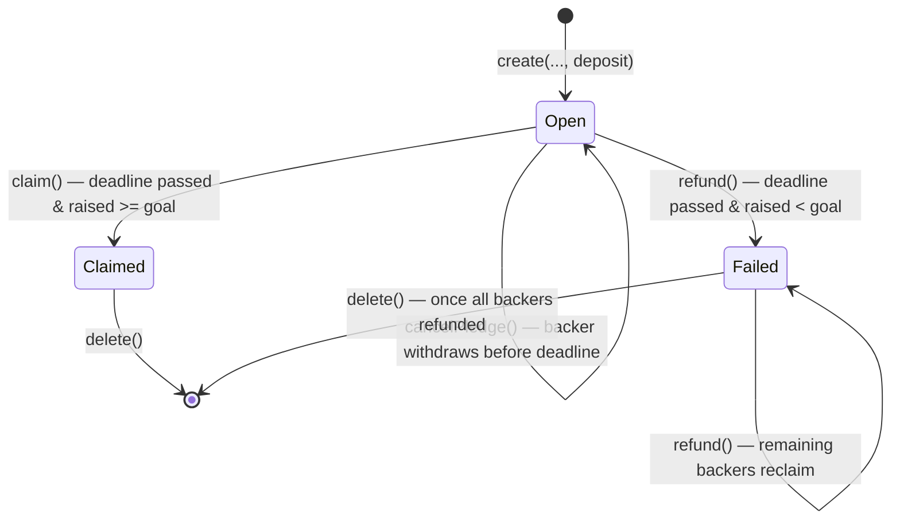

# Campaign contract

The `Campaign` contract (`smart_contracts/campaign/contract.algo.ts`) is the core of
AlgorArt: a non-custodial crowdfunding escrow. One stateful application per campaign.

Source of truth is the Algorand chain. The contract — not a server — holds pledged ALGO
and enforces the campaign rules.

## Contract vs application

**Contract** = the code: `contract.algo.ts`, compiled into TEAL approval/clear
programs. **Application** = one deployed instance of that code, with an app ID,
global state, boxes, and an associated **app account** (the escrow) that holds
ALGO.

Deployment is a single `create()` app-create transaction that uploads the TEAL and
instantiates one campaign atomically — there is no separate "deploy the code" step,
and the only applications that exist are campaigns. The compiled programs live in
`smart_contracts/artifacts/campaign/` (`Campaign.approval.teal`,
`Campaign.clear.teal`) and are embedded in the app-create transaction, so they end
up stored and executed on-chain. The ARC-32/56 specs and the generated client are
tooling-only and never go on-chain.

## The Merkle-tree design

Instead of a box per backer (the earlier design), the campaign commits every pledge
to an **on-chain incremental Merkle tree**. A backer's pledge is a leaf
`(address, amount)`; the tree root is stored in global state and updated on every
pledge. A refund or cancel is proven with a **Merkle proof** against that root and
double-spend is stopped by a 1-bit-per-leaf spent bitmap. This keeps the escrow's
storage at a small fixed size regardless of how many people pledge, so refunds and
deletion scale to tens of thousands of backers with no per-backer cleanup loop.

The full design rationale is in [`commitment-redesign.md`](commitment-redesign.md);
this file documents the contract as built.

## State

### Global state

| Key | Type | Meaning |
| --- | --- | --- |
| `creator` | `Account` | Campaign creator; the only account allowed to `claim()` / `delete()` |
| `title` | `bytes` | Short campaign title, fixed at `create()` |
| `metadataUri` | `bytes` | URI of off-chain campaign metadata (ARC-3-style JSON blob) |
| `goal` | `uint64` | Funding target, in microAlgos |
| `deadline` | `uint64` | UNIX timestamp (seconds) after which the outcome is decided |
| `raised` | `uint64` | Total microAlgos pledged so far (sum of live, non-spent leaves) |
| `status` | `uint64` | `0` Open, `1` Failed, `2` Claimed |
| `root` | `bytes` (32) | Merkle root over all pledge leaves |
| `leafCount` | `uint64` | Number of leaves appended so far (the backer count) |
| `deposit` | `uint64` | Storage deposit the creator fronts at `create()` (see below) |

### Boxes

| Box | Key | Value | Meaning |
| --- | --- | --- | --- |
| `frontier` | `'f'` | 1344 `bytes` | The MMR frontier: completed-subtree roots, one 32-byte slot each (at most 42) |
| `spent` (map) | shard index | 1024 `bytes` | Sharded spent bitmap, one bit per leaf index |

The `frontier` box holds the incremental tree's completed subtrees (empty slots are
32 zero bytes). The `spent` `BoxMap` is sharded into 1024-byte chunks (8192 leaves
each) so a single refund touches at most one box, under the box-I/O budget.

## State machine

## Settlement is pull-based

Nothing runs automatically on Algorand: smart contracts execute only when someone
submits a transaction. The `deadline` is a timestamp **guard**, not a trigger —
there is no cron, scheduler, or "at deadline, settle" event.

- **Successful campaign:** the deadline passes and nothing happens. The creator must
  call `claim()` for the payout to execute.
- **Failed campaign:** the deadline passes and nothing happens. Each backer must
  call `refund()` with their proof to reclaim their pledge. Until a refund is
  called, the pledge sits in the escrow indefinitely.
- **Open campaign:** a backer can call `cancelPledge()` any time before the
  deadline to withdraw their pledge.
- **Creator lock-up:** creating the app raises the creator's *own* account minimum
  balance by a sponsorship floor (the 0.1 ALGO app base + the global-state schema,
  ≈ 0.471 ALGO total), freed by deleting the app. The creator additionally fronts a
  **storage deposit** into the escrow (see below), recovered by deleting the app.

Every movement of funds (claim, refund, cancel, delete) is an explicit transaction
submitted by a caller; none of it is automatic.

## Methods & guards

### `create(title, metadataUri, goal, deadline, deposit)`

- `@abimethod({ onCreate: 'require' })` — only runs in the app-create transaction.
- Guards: must be app-create (`applicationId == 0`), `title` non-empty, `title` and
  `metadataUri` at most 128 bytes each (the AVM cap for a bytes global-state value),
  `goal > 0`, deadline in the future.
- Guards on `deposit` (a `gtxn.PaymentTxn`): it must come from `Txn.sender` (the
  creator), be paid to the escrow, and be at least **1,970,500 µA** (`MIN_DEPOSIT`).
- Sets `creator`, `title`, `metadataUri`, `goal`, `deadline`, `raised = 0`,
  `status = Open`, `root = EMPTY[15]` (the empty tree), `leafCount = 0`, and
  `deposit = deposit.amount`.
- `title` is immutable; `metadataUri` is an off-chain pointer (description/image/category).

### `pledge(payment)`

- Takes a `gtxn.PaymentTxn` — the caller submits this app call in a group with a payment
  from their own account to the app's escrow address.
- Guards:
  - before the deadline (`Global.latestTimestamp < deadline`)
  - `payment.receiver == Global.currentApplicationAddress` (escrow)
  - `payment.sender == Txn.sender` (payer is the caller)
  - `payment.amount > 0`
  - `Txn.sender != creator` (a creator cannot pledge to their own campaign)
- Appends a leaf `(Txn.sender, amount)` to the tree, updating the `frontier` box and
  `root`, then adds `amount` to `raised` and increments `leafCount`.
- **Re-pledging is allowed** — each pledge appends a *new* leaf; a backer's total is
  the sum of their live leaves (computed off-chain for the UI).

### `claim()`

- Creator only (`Txn.sender == creator`), after the deadline, and `raised >= goal`.
- Guards: `status == Open` (prevents double payout).
- Sets `status = Claimed`, then pays `balance − minBalance` (the spendable amount)
  to the creator — the minimum balance stays in the escrow (see below).

### `refund(siblings, index, amount)`

- Any backer, after the deadline, and `raised < goal`.
- Materialises `status = Failed` on the first refund; subsequent calls require it.
- Verifies the Merkle proof: recomputes `sha256(leaf) → … → root` over the `h`
  sibling hashes and asserts it equals `root`. The proof binds the caller's address
  and `amount` to the tree, so the amount cannot be forged.
- Checks and sets the leaf's bit in the spent bitmap; a second refund of the same
  leaf fails with `already spent`.
- Pays `amount` to `Txn.sender`. The backer pays the fees (app call + one inner
  payment ≈ 0.002 ALGO); the refund amount is never reduced.

### `cancelPledge(siblings, index, amount)`

- Backer only, **before** the deadline, while the campaign is still `Open`.
- Verifies the proof and marks the leaf spent (same machinery as `refund`), then
  decrements `raised` by `amount` and pays it back.
- The spent bit makes a second cancel impossible; the backer pays ≈ 0.002 ALGO.
- **Trade-off:** while `Open`, `raised` is a live, revocable number. A large backer
  can pledge to make a campaign look near-funded, then withdraw just before the
  deadline. The deadline remains the sole arbiter of the outcome — accepted for a
  non-custodial demo. Because each pledge is its own leaf, cancelling several
  pledges costs one call (and one fee) per leaf.

### `delete()`

A guarded `@abimethod({ allowActions: 'DeleteApplication' })`:

- **Creator only** (`Txn.sender == creator`).
- **Settled only** (`status != Open`) — an open campaign cannot be deleted.
- **No backer funds remain**: the escrow balance must be at most the creator's
  deposit (`balance <= deposit`). Since `balance = deposit + unrefunded pledges`,
  this is exactly "every backer has been refunded or the creator has already
  claimed".
- Deletes the `frontier` box and every spent shard, then an inner
  `closeRemainderTo: creator` payment closes the app account and returns its entire
  remaining balance (the deposit + base) to the creator, freeing the sponsorship
  floor on the creator's own account.

## The storage deposit

This is the one genuinely new piece of the funding model and the key to making
refunds scale. It exists to answer a single question: **who pays for the escrow's
fixed storage, and how do backers get 100% of their pledge back?**

### The problem it solves

Boxes are not free. Every box raises the app account's minimum balance by
`2500 + 400 × (key bytes + value bytes)` µA, and that ALGO is locked in the escrow
for as long as the box exists. The new contract uses **fixed** boxes:

- the 1344-byte `frontier` box → **540,500 µA** of MBR;
- each 1024-byte spent shard → **415,700 µA** of MBR (up to 4 shards at 32,768 backers).

A refund does **not** free any of this — it only flips a bit in the spent bitmap;
the boxes and their MBR persist until `delete()`. So if the backers' pledges were
the only money in the escrow, the fixed MBR would be silently carved out of the
refund pool:

| Event (3 backers × 1 ALGO, failed) | Escrow balance | min balance | Spendable |
| --- | --- | --- | --- |
| pledge × 3 | 3.00 | 0.64 (base + frontier) | 2.36 |
| A refunds (creates shard 0) | 2.00 | 1.06 (+ shard) | 0.94 |
| B refunds | 1.00 | 1.06 | 0.00 |
| **C refunds** | **fails** — needs 1.00, none left | | |

The last backer could not be refunded. The old per-backer-box design sidestepped
this because each refund *deleted* the backer's box and freed its MBR; the new
design has no per-backer box to delete.

### The fix: the creator fronts the storage

`create()` requires the creator to pay a **storage deposit** — at least
`MIN_DEPOSIT = 2,303,300 µA` (≈ 2.30 ALGO), the worst-case fixed MBR (0.1 base +
frontier + all four shards) — into the escrow. The deposit is recorded in global
state, is **not** counted in `raised`, and is returned to the creator.

With the deposit covering the storage, the escrow always holds
`deposit + pledged` while its minimum balance is at most `deposit`, so backers'
pledges are 100% spendable and every refund returns the full amount. The last
backer is never stranded.

### The money round-trip

The deposit is not spent, only parked. For a campaign with `P` total pledges:

- **Success:** `claim()` pays `balance − minBalance` = `P + (deposit − minBalance)`
  — the pledges plus the deposit surplus. `delete()` then closes the escrow and
  returns the residual `minBalance` (the deposit remainder). The creator nets
  `P + deposit`, minus fees.
- **Failure:** each backer refunds their full pledge; the escrow is left holding
  exactly the deposit. `delete()` returns it (plus the base) to the creator.

The `balance <= deposit` guard in `delete()` is what makes both cases safe: it is
false exactly when some backer's pledge has not yet been refunded on a failed
campaign, so the creator can never sweep backer funds.

## Boxes & minimum balance

A **box** is named key–value storage attached to an application. Boxes differ from
global state in two ways that matter here:

- A box value can be up to 32 KB, versus the 128-byte cap on a global-state value.
- **Every box increases the app account's minimum balance requirement (MBR).**

### Minimum balance

Every Algorand account must keep a minimum balance or the network treats it as
closed. An application's storage minimum balance is split across two accounts:

- The **app account** holds the 0.1 ALGO network-wide base plus the MBR for every
  box it owns — here, the frontier box plus the spent shards.
- The **creator's account** (the *size sponsor*) carries the MBR for the app's
  global-state schema and extra program pages — not the app account. For this
  contract (6 ints + 4 byte-slices, single program page) that floor is a fixed
  **0.471 ALGO** (`100,000 + 28,500 × 6 + 50,000 × 4` µA), the same for every
  campaign and independent of backers.

The fixed box MBR, in contrast to the old per-backer boxes, does **not** grow with
the backer count:

| Box | Size | MBR |
| --- | --- | --- |
| `frontier` | 1344 bytes | `2500 + 400 × 1345` = 540,500 µA |
| `spent` shard (× up to 4) | 1024 bytes | `2500 + 400 × 1033` = 415,700 µA each |

A campaign at full capacity (32,768 backers) locks at most 0.1 + 0.54 + 4 × 0.42 ≈
2.30 ALGO of box MBR, regardless of backer count — that is what `MIN_DEPOSIT`
covers, and it is paid by the creator, not the backers.

### Who pays for it

- The **creator** pays the sponsorship floor (locked on their own account) and the
  storage deposit (parked in the escrow). Both come back on `delete()`.
- The **backer** pays only their pledge: one payment of exactly `X` ALGO, nothing
  extra. Because the deposit already covers the storage MBR, a pledge can be
  arbitrarily small — there is no "first pledge must cover the box MBR" rule
  anymore.

## Design decisions

1. **`Funded` is a derived state.** There is no separate `settle()` call, so
   `claim()`/`refund()` evaluate the deadline and goal directly. `Funded` is never
   materialised into global state; only `Open`, `Failed`, and `Claimed` are stored.
2. **Escrow payout is `balance − minBalance`.** The app account must keep its minimum
   balance to remain alive, so the contract only ever pays out the spendable amount.
3. **One leaf per pledge (append-only).** A backer who pledges twice gets two leaves;
   there is no on-chain accumulation. `raised` is the sum of live leaves, and a
   backer's total is aggregated off-chain. See
   [`commitment-redesign.md`](commitment-redesign.md).
4. **Refunds and cancels are proof-based.** The contract never stores a backer's
   amount — it re-derives it from the address and the leaf proof, so the amount
   cannot be forged without breaking SHA-256.
5. **The spent bitmap is the nullifier.** Both `refund` and `cancelPledge` check and
   set the same 1-bit-per-leaf bitmap, so a leaf can be spent exactly once.
6. **`claim()` guards against re-entrancy/replay** with the `already claimed` status check.
7. **Creators cannot self-pledge.** `pledge()` rejects `Txn.sender == creator`. A self-pledge is not a direct
   funds leak (the creator would only move their own ALGO in and out), but it lets a creator fabricate the
   `raised` number to make a campaign look funded — undermining the trust story the contract exists to provide.
8. **The storage deposit makes refunds clean.** The creator fronts the escrow's fixed
   storage MBR so backers' pledges are never used for storage and every refund
   returns the full amount. The deposit is returned on `delete()`.
9. **`delete()` is safe by balance, not by box count.** The `balance <= deposit` guard
   means the creator can delete only when no backer funds remain — uniformly for a
   claimed campaign (already drained) and a fully-refunded failed one.
10. **Pledges are cancellable before the deadline.** `cancelPledge` lets a backer withdraw while the
    campaign is still `Open`, mirroring Kickstarter's "not charged until the deadline" model. It reintroduces the
    revocable-`raised` concern the self-pledge ban guards against, but the deadline remains the sole arbiter of the
    outcome — accepted for a non-custodial demo.

## Known edge cases

1. **Zero-pledge campaign stays `Open`.** `refund()` materialises `Failed` **and**
   requires a valid proof in the same atomic call, so a campaign nobody pledged to
   never records `Failed` on-chain. The UI still derives "failed", so it is cosmetic.
2. **Stray ALGO sent directly to the escrow.** A plain payment to the app address
   bypasses `pledge()`. On success `claim()` pays `balance − minBalance`, so stray
   ALGO goes to the creator; on failure it sits above the deposit and blocks
   `delete()` until it is drained (it is never in a leaf). Documented and accepted.
3. **Opcode budget.** The tree is a fanout-8 tree at height 5 (`sha256`, 35 opcode
   cost); a pledge (append + fold) and a refund (proof verify) are each ~5 hashes,
   well inside the 700-cost app-call budget. A binary tree could not fit at this
   capacity — its per-level empty-padding dominated the budget (measured on
   LocalNet against AVM v11). See
   [`commitment-redesign.md`](commitment-redesign.md) for the analysis.
4. **Re-pledge → cancel → re-pledge.** Cancelling marks one leaf spent and decrements
   `raised`; a later pledge appends a fresh leaf. The UI must present the *sum* of a
   backer's live leaves.
5. **Deadline boundary.** Pledging/cancelling use `latestTimestamp < deadline` while
   claim/refund use `>=`, so at the exact `==` block pledging is closed and settlement is
   open. Test the `==` boundary explicitly.
6. **The spent bitmap shard is created lazily.** The first refund or cancel creates
   the shard (raising the escrow's MBR); the deposit covers it, so no backer is
   short-changed.
7. **Overflow is impossible in practice.** `raised`, `leafCount`, and leaf amounts are
   `uint64`; an overflow would need more ALGO than the total supply. No guard needed.

## Frontend integration

The UI consumes the contract through the generated `CampaignClient` and the
indexer. Pages, data flow, the indexer decoding model, the exact call patterns,
and the client gotchas all live in [`frontend.md`](frontend.md). This doc only
describes the on-chain behavior each method enforces.

How ended campaigns stay browsable after the escrow is swept — and the role of
the catalog backend — lives in [`architecture.md`](architecture.md).

## Testing

A full behavioral matrix lives in `contract.algo.spec.ts` — every method × every
branch (caller checks, deadline checks, goal checks, proof verification, spent
bitmap, double-claim, double-refund). Tests run offline via
`algorand-typescript-testing` + Vitest, cross-checking the contract's Merkle root
against the plain-TypeScript reference in `smart_contracts/merkle/tree.ts`.

A LocalNet integration suite in `contract.integration.test.ts` deploys the compiled
TEAL and exercises the full lifecycle (create → pledge → claim → delete, and →
refund → delete).

See [`testing.md`](testing.md) for the tooling setup, API cheat sheet, coverage
matrix, and integration notes.

## References

Official Algorand docs backing the claims in this file (verify against these
when in doubt):

- [Applications](https://dev.algorand.co/concepts/smart-contracts/apps/) — app
  lifecycle and the `DeleteApplication` transaction.
- [Box Storage](https://dev.algorand.co/concepts/smart-contracts/storage/box/) —
  box MBR formula (`2500 + 400 × (key + value)`), box deletion, and the rule that
  deleting an app does **not** delete its boxes (their MBR stays locked).
- [AVM opcodes](https://developer.algorand.org/docs/get-details/dapps/avm/teal/opcodes/) —
  `sha256` (35 cost), `sha512_256` (45 cost), and the 700-cost app-call budget.
- [Inner Transactions](https://dev.algorand.co/concepts/smart-contracts/inner-txn/) —
  app-account payments and inner-transaction fees.
- [Transaction Types](https://dev.algorand.co/concepts/transactions/types/) — the
  payment `close` field and the application delete transaction.
- [Indexer REST API](https://dev.algorand.co/reference/rest-api/indexer/) — the
  `deleted` / `deleted-at-round` application fields and the `include-all` query
  parameter.
