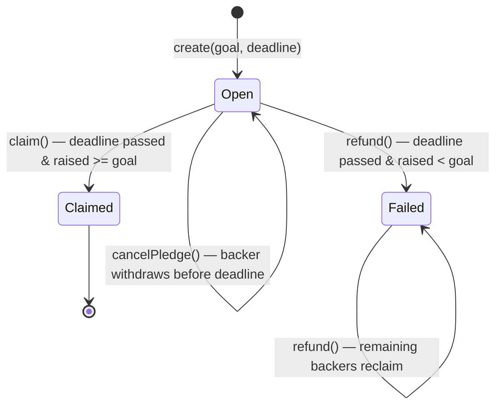

# Campaign contract

The `Campaign` contract (`smart_contracts/campaign/contract.algo.ts`) is the core of
AlgorArt: a non-custodial crowdfunding escrow. One stateful application per campaign.

Source of truth is the Algorand chain. The contract — not a server — holds pledged ALGO
and enforces the campaign rules.

## Contract vs application

**Contract** = the code: `contract.algo.ts`, compiled into TEAL approval/clear
programs. **Application** = one deployed instance of that code, with an app ID,
global state, boxes, and an associated **app account** (the escrow) that holds
ALGO.

Deployment is a single `create()` app-create transaction that uploads the TEAL and
instantiates one campaign atomically — there is no separate "deploy the code" step,
and the only applications that exist are campaigns. The compiled programs live in
`smart_contracts/artifacts/campaign/` (`Campaign.approval.teal`,
`Campaign.clear.teal`) and are embedded in the app-create transaction, so they end
up stored and executed on-chain. The ARC-32/56 specs and the generated client are
tooling-only and never go on-chain.

## State

### Global state

| Key | Type | Meaning |
| --- | --- | --- |
| `creator` | `Account` | Campaign creator; the only account allowed to `claim()` |
| `title` | `bytes` | Short campaign title, fixed at `create()` |
| `metadataUri` | `bytes` | URI of off-chain campaign metadata (ARC-3-style JSON blob) |
| `goal` | `uint64` | Funding target, in microAlgos |
| `deadline` | `uint64` | UNIX timestamp (seconds) after which the outcome is decided |
| `raised` | `uint64` | Total microAlgos pledged so far |
| `status` | `uint64` | `0` Open, `1` Failed, `2` Claimed |

### Boxes

| Map | Key | Value | Meaning |
| --- | --- | --- | --- |
| `pledges` | backer address | `uint64` | That backer's pledged microAlgos |

## State machine

## Settlement is pull-based

Nothing runs automatically on Algorand: smart contracts execute only when someone
submits a transaction. The `deadline` is a timestamp **guard**, not a trigger —
there is no cron, scheduler, or "at deadline, settle" event.

- **Successful campaign:** the deadline passes and nothing happens. The creator (or
  anyone, if `claim()` were made permissionless) must call `claim()` for the payout
  to execute.
- **Failed campaign:** the deadline passes and nothing happens. Each backer must
  call `refund()` to reclaim their pledge, or someone sweeps with `refundBatch()`
  until the escrow is drained. Until a refund is called, the pledge sits in the
  escrow indefinitely.
- **Open campaign:** a backer can call `cancelPledge()` any time before the
  deadline to withdraw their pledge and free their box.
- **Creator lock-up:** creating the app does **not** move ALGO into the escrow — it
  raises the creator's *own* account minimum balance by a sponsorship floor (the
  0.1 ALGO app base + the global-state schema, ≈ 0.364 ALGO total). That floor is
  freed by deleting the app. Each backer's box MBR, in contrast, is real ALGO in
  the escrow, freed only by deleting that box. Neither is automatic, and no
  cleanup method exists yet.

Every movement of funds (claim, refund, sweep, delete) is therefore an explicit
transaction submitted by a caller; none of it is automatic.

## Methods & guards

### `create(title, metadataUri, goal, deadline)`

- `@abimethod({ onCreate: 'require' })` — only runs in the app-create transaction.
- Guards: must be app-create (`applicationId == 0`), `title` non-empty, `title` and
  `metadataUri` at most 128 bytes each (the AVM cap for a bytes global-state value),
  `goal > 0`, deadline in the future.
- Sets `creator`, `title`, `metadataUri`, `goal`, `deadline`, `raised = 0`, `status = Open`.
- `title` is immutable; `metadataUri` is an off-chain pointer (description/image/category).

### `pledge(payment)`

- Takes a `gtxn.PaymentTxn` — the caller submits this app call in a group with a payment
  from their own account to the app's escrow address.
- Guards:
  - before the deadline (`Global.latestTimestamp < deadline`)
  - `payment.receiver == Global.currentApplicationAddress` (escrow)
  - `payment.sender == Txn.sender` (payer is the caller)
  - `payment.amount > 0`
  - `Txn.sender != creator` (a creator cannot pledge to their own campaign)
- Adds `payment.amount` to the backer's box and to `raised`.
- **Re-pledging is allowed** — each payment is added to the existing box total.

### `claim()`

- Creator only (`Txn.sender == creator`), after the deadline, and `raised >= goal`.
- Guards: `status == Open` (prevents double payout).
- Sets `status = Claimed`, then pays `balance − minBalance` (the spendable amount)
  to the creator — the minimum balance stays in the escrow (see Boxes & minimum balance).

### `refund()`

- Any backer, after the deadline, and `raised < goal`.
- Materialises `status = Failed` on the first refund; subsequent calls require it.
- Guard: the caller's pledge box must exist (prevents refunding twice or refunding non-backers).
- Deletes the box and pays the box amount back to the caller. The backer pays the
  fees (app call + one inner payment ≈ 0.002 ALGO); the refund amount is never reduced.

### `cancelPledge()`

- Backer only (`Txn.sender` must have a pledge box), **before** the deadline, while
  the campaign is still `Open`.
- Deletes the caller's pledge box, pays the box amount back to the caller, and
  decrements `raised` by that amount.
- The box delete makes a second cancel impossible (same pattern as `refund`); the
  backer pays ≈ 0.002 ALGO (app call + one inner payment).
- **Trade-off:** while `Open`, `raised` becomes a live, revocable number. A large
  backer can pledge to make a campaign look near-funded, then withdraw just before
  the deadline. This mirrors the creator self-pledge concern (design decision 7)
  but from the backer side, and the deadline remains the sole arbiter of the
  outcome — accepted for a non-custodial demo.

### `refundBatch(backers...)`

> **Proposed** — documented for design alignment; not yet implemented.

- Refunds up to 8 backers in a single call (the AVM box-reference limit), one
  inner payment per backer, deleting each pledge box.
- **Callable by anyone** after the deadline when `raised < goal` — the sweep is
  permissionless, so closure does not depend on the creator returning.
- The outer app-call fee must cover the app call plus one minimum fee per inner
  payment: ≈ 0.009 ALGO for a full batch of 8. Refund amounts are never reduced
  by fees; the caller pays.

### `delete(backers)`

Implemented as a guarded `@abimethod({ allowActions: 'DeleteApplication' })`:

- **Creator only** (`Txn.sender == creator`).
- **Settled only** (`status != Open`) — an open campaign cannot be deleted.
- On a **`Claimed`** campaign the listed `backers`' boxes are deleted (frees their
  MBR), then an inner `closeRemainderTo: creator` payment closes the app account,
  returning the residue (base + freed box MBR + any stray ALGO) to the creator.
- On a **`Failed`** campaign the `backers` list is ignored and `closeRemainderTo`
  runs alone: it fails on any outstanding box, so an un-refunded pledge can never
  be swept into the creator's pocket.
- Deleting the app frees the creator's own 0.364 ALGO sponsorship floor.

#### What it exists for

`delete()` is the cleanup path: it frees the creator's sponsorship lock-up and can
recover the escrow's residual ALGO after a campaign is settled. It is not needed
for correctness — `claim()` already pays out `balance − minBalance` — it exists
purely to reclaim residue and close the campaign record.

#### Verified on LocalNet (real contract)

The LocalNet tests confirmed where the ALGO actually sits (numbers are real,
observed against the compiled `Campaign` contract):

- **Creating the app does not fund the escrow.** After `create()`, the app account
  balance is **0** while its minimum balance is 100,000 µA (0.1 ALGO). The 0.1 ALGO
  base plus the global-state schema (28,500 × ints + 50,000 × byte-slices) is
  carried as a **sponsorship floor on the creator's own account**: the creator's
  minimum balance rises by 364,000 µA (0.364 ALGO) at create and drops back by the
  same amount when the app is deleted. It never leaves the creator's wallet; it is
  only locked.
- **A pledge funds the box, not the base.** Each backer's pledge pays real ALGO into
  the escrow and, in the same group, creates a box that raises the app account's
  minimum balance by 18,900 µA (`2500 + 400 × (33-byte key + 8-byte value)`).
- **`claim()` is correct.** The app account cannot pay out below its minimum balance
  (an attempt to leave only the box MBR fails with `balance … below min …`), so
  `balance − minBalance` is the maximum payout. The residue left behind is the
  0.1 ALGO base + every backer's box MBR.
- **A bare `DeleteApplication` returns nothing.** Deleting the app without first
  deleting boxes or sweeping leaves the app account balance in the now-deleteless
  account; the creator only pays the 1,000 µA delete fee.
- **Box MBR is locked if the app is deleted with boxes outstanding.** The boxes
  become non-modifiable, their MBR stays locked, and an inner payment with
  `CloseRemainderTo` is rejected with `cannot close: N outstanding boxes`. The
  [box docs](https://dev.algorand.co/concepts/smart-contracts/storage/box/) state
  the same: *"If an application with outstanding boxes is deleted, the MBR is not
  recoverable."*
- **`CloseRemainderTo` recovers the full residual balance** — but only once every
  box is gone. An inner payment with `closeRemainderTo: creator` closes the app
  account and returns its entire balance (0.1 base + freed box MBR + any surplus)
  to the creator. This is the documented
  [Close an Account](https://dev.algorand.co/concepts/transactions/types/) mechanism.

#### The corrected model

There is no "base 0.1 ALGO stranded in the escrow" to recover — the 0.1 ALGO base
is a sponsorship floor on the creator's *own* account, freed automatically by
deleting the app. What *is* recoverable is the residue left in the escrow after
`claim()` (0.1 base + box MBR, paid for by backers' pledges), and that is recovered
with `CloseRemainderTo` once all boxes are deleted.

| Case | What the creator recovers |
| --- | --- |
| Failed, fully refunded (no boxes) | `CloseRemainderTo` closes the empty account; the app delete frees their own 0.364 ALGO floor |
| Claimed, boxes remain | `delete(backers)` deletes the listed boxes, then `CloseRemainderTo` returns the residue (base + box MBR) |
| Failed, un-refunded boxes | `delete()` fails (`CloseRemainderTo` cannot close) — safe, backers can still refund |
| Open | Not deletable (guard) |

#### Decision

The guarded `delete(backers)` with `CloseRemainderTo` (option 1 below) is
implemented and covered by the LocalNet integration suite. Box-MBR recovery is
therefore done in a single call for up to 8 backers; a batched sweep for more is
deferred as unnecessary at demo scale.

#### Design options (resolved)

1. **Guarded `delete(backers)` with `CloseRemainderTo` (chosen).** Creator-only,
   settled campaigns only; deletes listed boxes on a claimed campaign and closes
   the app account to the creator. Fully-refunded failed campaigns close in one
   call; a claimed campaign with ≤ 8 backers recovers everything in one call; a
   campaign with outstanding boxes fails safely.
2. **Batched sweep for > 8 backers.** Deferred — recover box MBR via a multi-call
   loop only if backer counts ever warrant it.
3. **No cleanup at all.** Rejected; the guarded delete is cheap and makes the
   money story auditable end-to-end.

## Boxes & minimum balance

A **box** is named key–value storage attached to an application. Each backer gets
one box — keyed by their address, holding their pledged microAlgos — the `pledges`
map described above. Boxes differ from global state in two ways that matter here:

- A box value can be up to 32 KB, versus the 128-byte cap on a global-state value,
  so boxes hold per-backer data for an unbounded number of backers.
- **Every box increases the app account's minimum balance requirement (MBR).**

### Minimum balance

Every Algorand account must keep a minimum balance or the network treats it as
closed. An application's storage minimum balance is split across two accounts:

- The **app account** holds the 0.1 ALGO network-wide base plus the MBR for every
  box it owns.
- The **creator's account** (the *size sponsor*) carries the MBR for the app's
  global-state schema and extra program pages — not the app account. For this
  contract (4 ints + 3 byte-slices, single program page) that floor is a fixed
  **0.364 ALGO** (`100,000 + 28,500 × 4 + 50,000 × 3` µA), the same for every
  campaign and independent of backers.

The consensus formula for one pledge box (33-byte `p`-prefixed address key +
8-byte value):

$$ 2500 + 400 \times (\text{key bytes} + \text{value bytes}) = 18{,}900\ \mu\text{ALGO} \approx 0.0189\ \text{ALGO} $$

A campaign with 500 backers therefore locks ≈ 9.45 ALGO of box MBR in the app
account, on top of the creator's ~0.36 ALGO sponsorship floor.

### Who pays for it

The creator does **not** fund the escrow at `create()`. The app account starts at
balance 0; its base 0.1 ALGO minimum is carried by the creator's own account as a
sponsorship floor (the *size sponsor*, ≈ 0.364 ALGO total). Box MBR is **not** paid
by the creator either — each backer funds their own box atomically.

A backer who pledges `X` ALGO sends **one** payment of exactly `X` to the escrow —
nothing extra. The escrow balance rises by the full `X`, and in the same
transaction group the box is created, which raises the app account's `minBalance`
by ≈ 0.0189 ALGO. The box MBR is not an added cost to the backer; it is carved out
of `X` and locked in the escrow.

Because `balance >= minBalance` must hold after every transaction, a box can only
be created if the pledge covers it (verified on LocalNet):

- **The very first pledge** must be ≥ **0.1189 ALGO** — the 0.1 base plus the
  0.0189 box MBR — because the escrow starts empty and the first pledge must bring
  it up to its full minimum balance.
- **Each subsequent new backer** must pledge ≥ **0.0189 ALGO** (their box's MBR);
  the base is already covered.
- **A re-pledge by an existing backer** adds to an already-existing box and can be
  arbitrarily small, since no new MBR is created.

The protocol guarantees `balance >= minBalance` at all times by rejecting any
transaction that would leave an account below its minimum — so an underfunded
escrow is impossible; too-small pledges simply fail instead.

### The cost is real

Box MBR is not a fee — it is ALGO locked in the escrow for as long as the box
exists. Consequences:

- `claim()` pays `balance − minBalance`, so the creator receives roughly
  **0.0189 ALGO per backer less** than the total pledged. With 100 backers
  pledging 1 ALGO each, the creator gets ≈ 98 ALGO; the rest (box MBR ≈ 1.89 ALGO
  plus the 0.1 base) stays locked in the escrow.
- Deleting a box frees its MBR back into the spendable balance — `refund()` (and
  `cancelPledge()`) rely on this.
- The residue left after `claim()` (0.1 base + box MBR) is recoverable via the
  guarded [`delete(backers)`](#deletebackers) above — it deletes the boxes and
  closes the escrow with `CloseRemainderTo`.

## Design decisions

1. **`Funded` is a derived state.** There is no separate `settle()` call, so
   `claim()`/`refund()` evaluate the deadline and goal directly. `Funded` is never
   materialised into global state; only `Open`, `Failed`, and `Claimed` are stored.
2. **Escrow payout is `balance − minBalance`.** The app account must keep its minimum
   balance to remain alive, so the contract only ever pays out the spendable amount.
3. **First pledge uses `Box.get({ default: 0 })`.** Reading a missing box's `.value` would
   fail the transaction, so the first pledge defaults to 0.
4. **Re-pledging accumulates.** A backer's box holds the running total of all their
   payments; no separate pledge counter.
5. **Refund deletes the box after reading it.** This makes a second refund impossible
   (box no longer exists) and is safe because the payment is issued in the same transaction.
6. **`claim()` guards against re-entrancy/replay** with the `already claimed` status check.
7. **Creators cannot self-pledge.** `pledge()` rejects `Txn.sender == creator`. A self-pledge is not a direct
   funds leak (the creator would only move their own ALGO in and out), but it lets a creator fabricate the
   `raised` number to make a campaign look funded — undermining the trust story the contract exists to provide.
8. **Refund sweep is permissionless (proposed).** `refundBatch` is callable by any account, not just the
   creator, so a failed campaign can be fully drained even if the creator never returns. Whoever calls pays the
   batch fee; refund amounts are never reduced.
9. **Pledges are cancellable before the deadline (proposed).** `cancelPledge` lets a backer withdraw while the
   campaign is still `Open`, mirroring Kickstarter's "not charged until the deadline" model. It reintroduces the
   revocable-`raised` concern the self-pledge ban guards against, but the deadline remains the sole arbiter of the
   outcome — accepted for a non-custodial demo.
10. **Claim residue is recoverable via `CloseRemainderTo` after box deletion (proposed).** `claim()` deliberately
    keeps the app alive so the campaign record stays readable, but that leaves the 0.1 ALGO base plus every backer's
    box MBR in the escrow. A `delete()` that first deletes the boxes and then closes the app account with
    `CloseRemainderTo` recovers all of it — at the cost of freezing the on-chain record. The creator's own sponsorship
    floor (≈ 0.364 ALGO) is freed by any app delete.

## Known edge cases

The cases below drive implementation decisions for the proposed methods; they are
referenced from the contract items in [`roadmap.md`](roadmap.md).

1. **Zero-pledge campaign stays `Open`.** `refund()` materialises `Failed` **and**
   requires the caller's box to exist in the same atomic call, so a campaign nobody
   pledged to can never record `Failed` on-chain. The UI still derives "failed", so it
   is cosmetic — but a permissionless `settle()` (proposed) would close the gap.
2. **Stray ALGO sent directly to the escrow.** A plain payment to the app address
   bypasses `pledge()`. On success `claim()` pays `balance − minBalance`, so stray ALGO
   goes to the creator for free; on failure it is in no box and is stranded after all
   refunds (unless a `delete()` with `CloseRemainderTo` recovers it). Documented and accepted.
3. **`refundBatch` poisoning.** A single bad or duplicate address in a batch fails that
   backer's inner payment and reverts the whole batch. The frontend must dedupe and pass
   only live box addresses from the indexer.
4. **Opcode budget.** 8 inner payments + 8 box references approach the app-call budget;
   verify the batch actually compiles and reduce to 6–7 backers if not.
5. **Re-pledge → cancel → re-pledge.** Cancelling deletes the box and decrements
   `raised`; a later pledge must recreate the box with the fresh amount and re-increment
   `raised` correctly (needs an explicit test once `cancelPledge` exists).
6. **Deadline boundary.** Pledging/cancelling use `latestTimestamp < deadline` while
   claim/refund use `>=`, so at the exact `==` block pledging is closed and settlement is
   open. Test the `==` boundary explicitly.
7. **Claim leaves pledge boxes behind.** `claim()` does not delete backer boxes; they are
   dead data whose MBR stays locked until the boxes are deleted, and the UI must not
   show "your pledge" on a `claimed` campaign.
8. **Overflow is impossible in practice.** `raised` and box values are `uint64`; an
   overflow would need more ALGO than the total supply. No guard needed.

## Frontend integration

The UI consumes the contract through the generated `CampaignClient` and the
indexer. Pages, data flow, the indexer decoding model, the exact call patterns,
and the client gotchas all live in [`frontend.md`](frontend.md). This doc only
describes the on-chain behavior each method enforces.

How ended campaigns stay browsable after the escrow is swept — and the role of
the catalog backend — lives in [`architecture.md`](architecture.md).

## Testing

A full behavioral matrix lives in `contract.algo.spec.ts` — every method × every
branch (caller checks, deadline checks, goal checks, re-pledge, double-claim,
double-refund). Tests run offline via `algorand-typescript-testing` + Vitest.

A LocalNet integration suite in `contract.integration.test.ts` deploys the compiled
TEAL and exercises the full lifecycle (create → pledge → claim, and → refund).

See [`testing.md`](testing.md) for the tooling setup, API cheat sheet, coverage
matrix, and integration notes.

## References

Official Algorand docs backing the claims in this file (verify against these
when in doubt):

- [Applications](https://dev.algorand.co/concepts/smart-contracts/apps/) — app
  lifecycle and the `DeleteApplication` transaction.
- [Box Storage](https://dev.algorand.co/concepts/smart-contracts/storage/box/) —
  box MBR formula (`2500 + 400 × (key + value)`), box deletion, and the rule that
  deleting an app does **not** delete its boxes (their MBR stays locked).
- [Inner Transactions](https://dev.algorand.co/concepts/smart-contracts/inner-txn/) —
  app-account payments and inner-transaction fees.
- [Transaction Types](https://dev.algorand.co/concepts/transactions/types/) — the
  payment `close` field and the application delete transaction.
- [Indexer REST API](https://dev.algorand.co/reference/rest-api/indexer/) — the
  `deleted` / `deleted-at-round` application fields and the `include-all` query
  parameter.
