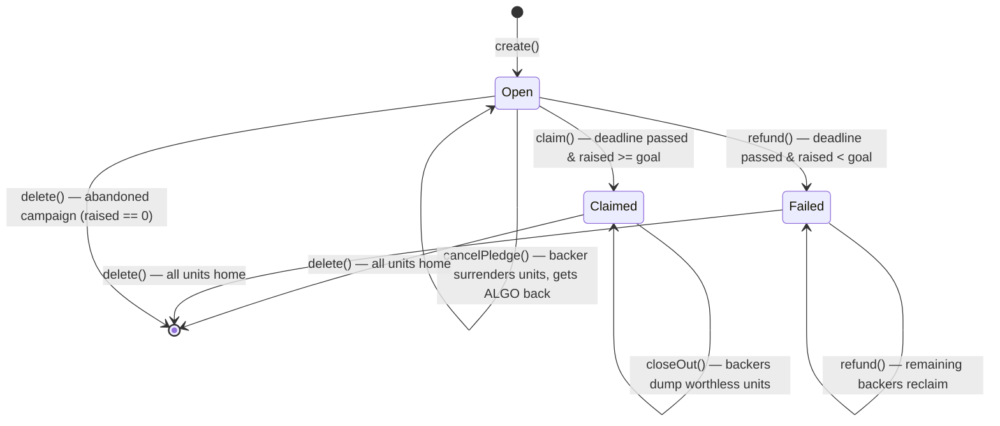

# Campaign contract

The `Campaign` contract (`smart_contracts/campaign/contract.algo.ts`) is the core of
AlgorArt: a non-custodial crowdfunding escrow. One stateful application per campaign,
plus a per-campaign **Claim ASA** that represents backers' refundable claims.

Source of truth is the Algorand chain. The contract — not a server — holds pledged ALGO
and enforces the campaign rules.

## Contract vs application

**Contract** = the code: `contract.algo.ts`, compiled into TEAL approval/clear
programs. **Application** = one deployed instance of that code, with an app ID,
global state, and an associated **app account** (the escrow) that holds ALGO and
owns the campaign's Claim ASA.

Deployment is a single `create()` app-create transaction that uploads the TEAL and
instantiates one campaign atomically. `fund()` then issues the Claim ASA. The
compiled programs live in `smart_contracts/artifacts/campaign/` (generated, gitignored);
the ARC-32/56 specs and the generated client are tooling-only and never go on-chain.

## The Claim ASA design

A backer's right to a refund is an **on-chain asset balance**. `fund()` creates the
campaign's Claim ASA via an inner transaction: `total = 2⁶⁴ − 1`, `decimals = 0`,
`manager = the escrow` (so only this contract can later destroy it), and **no**
reserve, freeze, or clawback — the claim is a freely transferable bearer instrument.
On `pledge`, the contract mints the same number of claim units as the pledged µA to
the backer (1 unit = 1 µA). On `refund`/`cancelPledge`, the backer surrenders units to
the escrow and receives the same amount back.

Because the surrender moves units *out of the backer's balance*, the same claim
cannot be redeemed twice: there are no units left to surrender. The asset ledger
itself is the anti-double-refund state — no Merkle tree, no spent bitmap, no boxes,
no local state. The design rationale and requirement analysis live in
[`claim-asa-redesign.md`](claim-asa-redesign.md).

## State

All state is global — **no boxes and no per-backer records**, so the campaign's
storage (and its creator's capital) is constant regardless of the backer count.

| Key | Type | Meaning |
| --- | --- | --- |
| `creator` | `Account` | Campaign creator; the only account allowed to `claim()` / `delete()` |
| `title` | `bytes` | Short campaign title, fixed at `create()` |
| `metadataUri` | `bytes` | URI of off-chain campaign metadata (ARC-3-style JSON blob) |
| `goal` | `uint64` | Funding target, in microAlgos |
| `deadline` | `uint64` | UNIX timestamp (seconds) after which the outcome is decided |
| `raised` | `uint64` | Live pledge total, in microAlgos (pledges minus cancellations/refunds) |
| `status` | `uint64` | `0` Open, `1` Failed, `2` Claimed |
| `claimAsa` | `uint64` | The campaign's Claim ASA id; `0` until `fund()` issues it |
| `deposit` | `uint64` | Storage deposit the creator fronts via `fund()` (returned by `delete()`) |

## State machine

## Settlement is pull-based

Nothing runs automatically on Algorand: smart contracts execute only when someone
submits a transaction. The `deadline` is a timestamp **guard**, not a trigger.

- **Successful campaign:** the deadline passes and nothing happens. The creator must
  call `claim()` for the payout.
- **Failed campaign:** each backer must call `refund()` with their own surrender
  transfer. Until then, the pledge sits in the escrow indefinitely — and stays
  redeemable forever, because the contract remains the ASA's manager.
- **Claimed campaign:** backers call `closeOut()` to dump the now-worthless units
  and recover their 0.1 ALGO opt-in minimum balance.

Every movement of funds is an explicit transaction submitted by a caller; none of
it is automatic, and none of it needs the platform.

## Methods & guards

### `create(title, metadataUri, goal, deadline)`

- `@abimethod({ onCreate: 'require' })` — only runs in the app-create transaction.
- Guards: must be app-create, `title` non-empty, `title`/`metadataUri` ≤ 128 bytes
  each (the AVM cap for a bytes global-state value), `goal > 0`, deadline in the
  future.
- Sets all state; `claimAsa` stays `0` until `fund()`.

### `fund(payment)`

- Creator only, while `Open`, and only once (`claimAsa == 0`).
- Guards: payment from the caller to the escrow, `amount >= 200_000` µA — the
  escrow's fixed minimum balance once the ASA exists (0.1 ALGO account base +
  0.1 ALGO for the created asset; measured on LocalNet).
- Issues the Claim ASA via an inner `assetConfig` (total 2⁶⁴−1, manager = escrow,
  no reserve/freeze/clawback), stores the new asset id in `claimAsa`, and records
  the payment as `deposit`. The deposit is **not** counted in `raised` and is
  returned by `delete()`.
- Without `fund()` there are no units to mint, so `pledge()` rejects until the
  ASA exists.

### `pledge(payment)`

- Guards: before the deadline, `status == Open`, payment from the caller to the
  escrow, `amount > 0`, caller is not the creator, and the Claim ASA has been
  issued.
- Mints `payment.amount` claim units to the caller via an inner asset transfer
  and adds the amount to `raised`. The backer must already be opted into the
  Claim ASA, or the mint fails and the whole group reverts atomically.
- **Re-pledging is allowed** — each pledge mints more units; a backer's total is
  their asset balance.

### `claim()`

- Creator only (`Txn.sender == creator`), after the deadline, `raised >= goal`,
  and `status == Open` (prevents double payout).
- Sets `status = Claimed`, then pays `balance − minBalance` (the spendable
  amount) to the creator. The escrow keeps its minimum balance; backers' claim
  units become worthless receipts.

### `refund(axfer)`

- Any holder, after the deadline, `raised < goal`.
- Materialises `status = Failed` on the first refund; subsequent calls require it.
- `axfer` must be an asset transfer **from the caller to the escrow** of the
  campaign's Claim ASA, `assetAmount > 0`, and **without** `closeRemainderTo`
  (so the received amount equals the amount paid out exactly).
- Pays `axfer.assetAmount` µA to the caller and decrements `raised`. A second
  refund fails at the transfer itself — the units no longer exist in the
  caller's balance. The backer pays the fees (asset transfer + app call + inner
  payment ≈ 0.003 ALGO); the refund amount is never reduced.

### `cancelPledge(axfer)`

- Any holder, **before** the deadline, while the campaign is `Open` — the
  explicit, safe cancellation path.
- Same surrender checks and payout as `refund`, decrementing `raised`.
- **Trade-off:** while `Open`, `raised` is a live, revocable number; the
  deadline remains the sole arbiter of the outcome — accepted for a
  non-custodial demo (same as the Merkle design).

### `closeOut(axfer)`

- Any holder, only when `status == Claimed`.
- `axfer` must close the caller's Claim ASA holding back to the escrow
  (`assetCloseTo == escrow`). Nothing is paid out. Reclaims the backer's own
  0.1 ALGO opt-in minimum balance.
- Once every holder has closed out, the escrow again holds the entire supply
  and the creator can `delete()`.

### `delete()`

A guarded `@abimethod({ allowActions: 'DeleteApplication' })`:

- **Creator only** (`Txn.sender == creator`).
- **Settled or abandoned only** (`status != Open`, or an open campaign with
  `raised == 0` — nobody is owed anything).
- **No outstanding claims**: the contract reads its own Claim ASA balance and
  requires `held == total` — exactly "every backer has refunded (failed) or
  closed out (claimed)". A delete can therefore never strand a backer's units
  or ALGO.
- Inner transactions: an `assetConfig` that **destroys the Claim ASA** (the
  escrow is the manager and holds the full supply), then a payment with
  `closeRemainderTo: creator` that closes the app account, returning the
  residual (the deposit) and freeing the creator's sponsorship floor.
- A never-funded campaign (`claimAsa == 0`) skips the destroy step — this is
  the recovery path for abandoned campaigns, so an abandoned campaign does not
  lock the creator's capital forever.

## Minimum balances

Every account/asset has a minimum balance (MBR). See
[`claim-asa-redesign.md`](claim-asa-redesign.md) for the full table; the
contract-relevant numbers:

| Item | Amount | Who pays | Recovered |
| --- | --- | --- | --- |
| Escrow (base + created asset) | 0.2 ALGO | Creator (`fund()` deposit) | `delete()` |
| App sponsorship floor (app base + global schema, on the creator's account) | ≈ 0.47 ALGO | Creator | `delete()` |
| Claim ASA opt-in | 0.1 ALGO | Backer | close-out / opt-out |
| Factory registration box | ≈ 0.019 ALGO | Creator (refundable) | `unregister()` |

The creator's total is a small constant (≈ 0.67 ALGO, recoverable); nothing
scales with the backer count.

## Design decisions

1. **The ASA balance is the nullifier.** `refund` and `cancelPledge` only pay
   against a surrender transfer; there is no other anti-double-spend state
   because the units themselves cannot be spent twice.
2. **Bearer claims.** Free transferability, whoever holds the units is entitled
   (see [`claim-asa-redesign.md`](claim-asa-redesign.md) for the analysis).
3. **1 unit = 1 µA, no fees on the peg.** The payout equals the surrendered
   amount, always.
4. **The creator fronts the escrow's fixed MBR.** Backers' pledges stay 100%
   spendable; the last refund can never underfund the escrow because
   `balance = deposit + outstanding` and `deposit ≥ minBalance`.
5. **`delete()` is safe by asset balance, not by bookkeeping.** The
   `held == total` check is the exact protocol condition for destroying the
   ASA, so the guard cannot be gamed into stranding units.
6. **`claim()` guards against replay** with the `already claimed` status check.
7. **Creators cannot self-pledge.** A self-pledge would fabricate the `raised`
   number and undermine the trust story.
8. **No boxes.** The campaign never creates box storage, so there is no box MBR
   residue and no box-cleanup loop on delete.

## Known edge cases

1. **Stray ALGO sent directly to the escrow.** A plain payment to the app
   address bypasses `pledge()` (no units minted). On success it rides along to
   the creator via `claim()`'s `balance − minBalance`; on failure it stays in
   the escrow and is swept to the creator by `delete()` once all refunds are
   done. Nobody can steal it, and it never blocks a refund (refunds are paid
   from `deposit + outstanding`, which the stray amount only increases).
2. **A claimed campaign waits on its holders.** The ASA cannot be destroyed
   until every backer closes out; documented in
   [`claim-asa-redesign.md`](claim-asa-redesign.md) as the main known
   limitation of the success path.
3. **Deadline boundary.** Pledging/cancelling use `latestTimestamp < deadline`
   while claim/refund use `>=`, so at the exact `==` block pledging is closed
   and settlement is open. Tested at the boundary.
4. **Overflow is impossible in practice.** `raised` and claim amounts are
   `uint64`; an overflow would need more ALGO than the total supply. The ASA
   total (2⁶⁴−1) likewise exceeds the µA that can ever exist.

## Limits & bounds

| Dimension | Min | Max |
| --- | --- | --- |
| Backers | 0 | no contract cap (bounded only by the ASA supply and ALGO supply) |
| Pledges per backer | 0 | no per-backer cap (balance accumulates) |
| Single pledge | 1 µA | none (`amount > 0`; bounded by the payer's balance) |
| Total raised | 0 | ALGO total supply (~10¹⁶ µA) |
| `goal` | 1 µA | none (uint64) |
| `deadline` | now + 1 second | none (uint64 seconds) |
| `title` | 1 byte | 128 bytes |
| `metadataUri` | 0 bytes | 128 bytes |
| Storage deposit (`fund`) | 200,000 µA | none |
| Escrow locked MBR | 0 | 200,000 µA (base + Claim ASA) — **constant** |
| Campaign storage | 9 global-state keys | never grows |

**Recommended, not enforced on-chain:**

- **Deposit** — fund **200,000 µA** (0.2 ALGO), the escrow's fixed MBR, so
  backers' pledges stay 100% refundable. Funding more also works and is
  returned on `delete()`.
- **Claim ASA opt-in** — the frontend performs it automatically on the first
  pledge.

## Frontend integration

The UI consumes the contract through the generated `CampaignClient` and the
indexer. Pages, data flow, the indexer decoding model, the exact call patterns,
and the client gotchas all live in [`frontend.md`](frontend.md). This doc only
describes the on-chain behavior each method enforces.

How ended campaigns stay browsable — and the role of the Factory and the
catalog — lives in [`architecture.md`](architecture.md).

## Testing

A full behavioral matrix lives in `contract.algo.spec.ts` — every method × every
branch (caller checks, deadline checks, goal checks, surrender validation, payout
checks, double-claim, status transitions). Tests run offline via
`algorand-typescript-testing` + Vitest.

A LocalNet integration suite in `contract.integration.test.ts` deploys the compiled
TEAL and exercises the full Claim-ASA lifecycle end-to-end with real balances and
MBR assertions (create → fund → opt-in → pledge → cancel/refund/claim → closeOut →
delete, plus the Factory round trip in `factory.integration.test.ts`).

See [`testing.md`](testing.md) for the tooling setup, API cheat sheet, coverage
matrix, and integration notes.

## References

Official Algorand docs backing the claims in this file (verify against these
when in doubt):

- [Asset Operations](https://developer.algorand.org/docs/get-details/asa/) — ASA
  creation, reconfiguration, deletion, opt-in/out, and the rule that an asset
  can be destroyed only when the creator holds the whole supply.
- [Applications](https://dev.algorand.co/concepts/smart-contracts/apps/) — app
  lifecycle and the `DeleteApplication` transaction.
- [Inner Transactions](https://dev.algorand.co/concepts/smart-contracts/inner-txn/) —
  app-account payments and inner-transaction fees.
- [Transaction Types](https://dev.algorand.co/concepts/transactions/types/) — the
  payment `close` field, the asset transfer `close`, and the application delete
  transaction.
- [Indexer REST API](https://dev.algorand.co/reference/rest-api/indexer/) — the
  `deleted` / `deleted-at-round` application fields and the asset-balance lookup.
