# Campaign contract

The `Campaign` contract (`smart_contracts/campaign/contract.algo.ts`) is one half of AlgorArt's escrow: a non-custodial crowdfunding
campaign whose **escrow holds only the creator's storage deposit**. Backers' pledged ALGO lives in the permanent **ClaimsVault**
(`smart_contracts/claimsvault/contract.algo.ts`), which also issues the campaign's Claim ASA and pays refunds, cancellations, and
successful claims.

Source of truth is the Algorand chain. The contract — not a server — enforces the campaign rules.

## Contract vs application

**Contract** = the code: `contract.algo.ts`, compiled into TEAL approval/clear programs. **Application** = one deployed instance of that
code, with an app ID, global state, and an associated **app account** (the escrow) that holds the creator's deposit and the campaign's
seeded Claim ASA supply.

Deployment is a single `create()` app-create transaction. The Claim ASA is issued by the vault afterwards (`issueClaimAsa` →
`attachClaimAsa` → `seedSupply`). The compiled programs live in `smart_contracts/artifacts/` (generated, gitignored); the ARC-32/56
specs and the generated clients are tooling-only and never go on-chain.

## The Claim ASA design

A backer's right to a refund is an **on-chain asset balance**. The vault issues the campaign's Claim ASA (`total = 2⁶⁴ − 1`,
`decimals = 0`, `manager = clawback = reserve = vault`, no freeze) and seeds its whole supply to the campaign app. On `pledge`, the
campaign mints the same number of claim units as the pledged µA to the backer (1 unit = 1 µA) while the payment goes to the **vault**. On
`refund`/`cancelPledge`, the backer surrenders units to the vault and receives the same amount back — paid by the vault.

Because the surrender moves units *out of the backer's balance*, the same claim cannot be redeemed twice. The asset ledger itself is the
anti-double-refund state — no Merkle tree, no spent bitmap, no boxes, no local state. The design rationale and requirement analysis live
in [`claim-asa-redesign.md`](claim-asa-redesign.md).

## State

All state is global — **no boxes and no per-backer records**, so the campaign's storage (and its creator's capital) is constant
regardless of the backer count.

| Key | Type | Meaning |
| --- | --- | --- |
| `creator` | `Account` | Campaign creator; the only account allowed to `claim()` / `delete()` |
| `vault` | `Application` | The ClaimsVault app — issues the Claim ASA, holds pledges, pays out |
| `title` | `bytes` | Short campaign title, fixed at `create()` |
| `metadataUri` | `bytes` | URI of off-chain campaign metadata (ARC-3-style JSON blob) |
| `goal` | `uint64` | Funding target, in microAlgos |
| `deadline` | `uint64` | UNIX timestamp (seconds) after which the outcome is decided |
| `raised` | `uint64` | Live pledge total, in microAlgos (pledges minus cancellations/refunds) |
| `status` | `uint64` | `0` Open, `1` Failed, `2` Claimed |
| `claimAsa` | `uint64` | The campaign's Claim ASA id; `0` until `attachClaimAsa()` |
| `deposit` | `uint64` | Storage deposit the creator fronts via `fund()` (returned by `delete()`) |

## State machine

```mermaid
stateDiagram-v2
    [*] --> Open: create()
    Open --> Open: fund() — storage deposit
    Open --> Open: issueClaimAsa() + attachClaimAsa() + seedSupply() — Claim ASA live
    Open --> Open: pledge() — mints claim units; ALGO to the vault
    Open --> Open: cancelPledge() — backer surrenders units, vault pays back
    Open --> Claimed: claim() — vault pays the creator; settlement recorded
    Open --> Failed: delete() on a failed campaign — vault settlement recorded; refunds stay open
    Failed --> Failed: vault.refund() — backers reclaim from the vault, forever
    Claimed --> Claimed: closeOut() — backers dump worthless units
    Claimed --> [*]: delete() — holding close + escrow close (O(1))
    Failed --> [*]: delete() — holding close + escrow close (O(1))
```

## Settlement is pull-based

Nothing runs automatically on Algorand: smart contracts execute only when someone submits a transaction. The `deadline` is a timestamp
**guard**, not a trigger.

- **Successful campaign:** the creator calls `claim()`; the vault pays.
- **Failed campaign:** each backer refunds — through the campaign while it lives, or **directly from the vault after the creator's
  `delete()`**, because the vault recorded the failed settlement. The backer's ALGO is never swept by anyone.
- **Claimed campaign:** backers `closeOut()` their worthless units to recover their own 0.1 ALGO opt-in.

Every movement of funds is an explicit transaction submitted by a caller; none of it is automatic, and none of it needs the platform.

## Methods & guards

### `create(vault, title, metadataUri, goal, deadline)`

- `@abimethod({ onCreate: 'require' })` — only runs in the app-create transaction.
- Guards: must be app-create, `title` non-empty, `title`/`metadataUri` ≤ 128 bytes each (the AVM cap for a bytes global-state value),
  `goal > 0`, deadline in the future. Stores everything; `claimAsa` stays `0` until attached.

### `fund(payment)`

- Creator only, while `Open`, before the Claim ASA is attached, `amount >= 200_000` µA — the escrow's fixed minimum balance (0.1 ALGO
  account base + 0.1 ALGO for the Claim ASA opt-in; measured on LocalNet).
- Records the deposit. The deposit is **not** counted in `raised`, is never touched by pledges or payouts, and is returned in full by
  `delete()`.

### `attachClaimAsa(asset)`

- Permissionless, once. Verifies the asset's provenance: `creator == vault`, `manager == vault`, `clawback == vault`,
  `total == 2⁶⁴ − 1`, `decimals == 0`. Only the real vault can issue such an asset, so a campaign whose creator stored a fake vault
  address is **inert**: no asset ever attaches and `pledge()` refuses payments.
- Self-opts the escrow in (inner zero-amount transfer), after which the vault seeds the supply.

### `pledge(payment)`

- Guards: before the deadline, `status == Open`, payment from the caller **to the vault**, `amount > 0`, caller is not the creator, and
  the Claim ASA has been attached.
- Mints `payment.amount` claim units to the caller via an inner asset transfer and adds the amount to `raised`. The backer must already
  be opted into the Claim ASA, or the mint fails and the whole group reverts atomically.
- **Re-pledging is allowed** — each pledge mints more units; a backer's total is their asset balance.

### `claim()`

- Creator only, after the deadline, `raised >= goal`, and `status == Open` (prevents double payout).
- Sets `status = Claimed` and inner-calls `vault.payClaim(app)`. The vault derives the payout from unit conservation
  (`total − vault holding − campaign holding` = the live pledge total), pays the creator, and records the claimed settlement — which
  rejects refunds afterwards.

### `refund(axfer)`

- Any holder, after the deadline, `raised < goal`.
- Materialises `status = Failed` on the first refund; subsequent calls require it.
- `axfer` must be an asset transfer **from the caller to the vault** of the campaign's Claim ASA, `assetAmount > 0`, without
  `closeRemainderTo`. The campaign inner-calls `vault.payBack(app, backer, amount)`, which pays from the pool. A second refund fails at
  the transfer itself — the units no longer exist. Fees (~0.004 ALGO) are paid by the backer; the refund amount is never reduced.

### `cancelPledge(axfer)`

- Any holder, **before** the deadline, while the campaign is `Open` — the explicit, safe cancellation path.
- Same surrender checks and vault payout as `refund`, decrementing `raised` (the goal check stays honest).

### `closeOut(axfer)`

- Any holder, only when `status == Claimed`. `axfer` closes the caller's Claim ASA holding back to the vault (`assetCloseTo == vault`).
  Nothing is paid out; the backer recovers their own 0.1 ALGO opt-in.

### `delete()`

A guarded `@abimethod({ allowActions: 'DeleteApplication' })`:

- **Creator only**.
- **Settled or abandoned only** — `status != Open`, or an open campaign with `raised == 0` (every unit returned), or a failed-in-fact
  campaign (deadline passed, `raised < goal`) which is materialised here.
- **Failed path:** inner-calls `vault.settle(app)` — from then on refunds are served **directly by the vault, forever**, even with the
  campaign deleted. **Claimed path:** the settlement was already recorded at `claim()`.
- Then two inner transactions: an asset transfer closing the escrow's own Claim ASA holding to the vault (`closeAssetTo` — legal, the
  escrow is not the asset's creator), and a payment with `closeRemainderTo: creator` that closes the app account, returning the deposit
  and freeing the sponsorship floor.
- **No supply check** is needed on either path: the escrow never holds backer funds, and closing the holding strands nobody — the Claim
  ASA stays alive under the vault, and outstanding units remain valid objects in backers' wallets.
- A never-funded campaign (`claimAsa == 0`) skips the settle and holding-close steps — the recovery path for abandoned campaigns.

## Minimum balances

Every account/asset has a minimum balance (MBR). See
[`claim-asa-redesign.md`](claim-asa-redesign.md) for the full table; the contract-relevant numbers:

| Item | Amount | Who pays | Recovered |
| --- | --- | --- | --- |
| Escrow (base + Claim ASA opt-in) | 0.2 ALGO | Creator (`fund()` deposit) | `delete()` |
| App sponsorship floor (on the creator's account) | ≈ 0.47 ALGO | Creator | `delete()` |
| Vault parked MBR per campaign (created asset + boxes) | ≈ 0.156 ALGO | Platform (accepted) | Optional GC (`destroyClaimAsa`) |
| Claim ASA opt-in | 0.1 ALGO | Backer | Opt-out / `closeOut()` |

The creator's total is a small constant (≈ 0.67 ALGO), fully recoverable in O(1) on **both** settlement paths.

## Design decisions

1. **The ASA balance is the nullifier.** Refunds and cancellations only pay against a surrender transfer; the units themselves cannot be
   spent twice.
2. **Bearer claims.** Free transferability; whoever holds the units is entitled (see
   [`claim-asa-redesign.md`](claim-asa-redesign.md)).
3. **1 unit = 1 µA, no fees on the peg.** The payout equals the surrendered amount, always.
4. **The split escrow.** Backers' ALGO never enters the campaign escrow, so no backer is ever on the creator's finalization path — the
   success and failure paths both finalize in O(1).
5. **The vault derives the claim payout from unit conservation** rather than trusting the campaign's bookkeeping.
6. **`delete()` is safe without a supply check** because it closes a holding, not the asset — it can never strand units or funds.
7. **Creators cannot self-pledge** — a self-pledge would fabricate the `raised` number and undermine the trust story.
8. **No boxes on the campaign** — no box MBR residue and no box-cleanup loop on delete.

## Known edge cases

1. **Stray ALGO sent to the vault.** A plain payment to the vault address (not through `pledge()`) inflates the pool without minting
   units. No payout path references it: refunds pay only against surrendered units and the claim pays only the derived outstanding total.
2. **Stray ALGO sent to the campaign escrow.** Rides along to the creator via `delete()`'s `CloseRemainderTo` on both paths; never blocks
   a refund (the vault pays those).
3. **A failed campaign's creator deposit waits for the last refund.** Correct behavior — the escrow refuses to sweep backer funds; see the
   limitations in [`claim-asa-redesign.md`](claim-asa-redesign.md).
4. **Deadline boundary.** Pledging/cancelling use `latestTimestamp < deadline` while claim/refund use `>=`; at the exact `==` block
   pledging is closed and settlement is open. Tested at the boundary.
5. **Overflow is impossible in practice.** `raised` and claim amounts are `uint64`; an overflow would need more ALGO than the total
   supply. The ASA total (2⁶⁴−1) likewise exceeds the µA that can ever exist.

## Limits & bounds

| Dimension | Min | Max |
| --- | --- | --- |
| Backers | 0 | no contract cap (bounded only by the ASA supply and ALGO supply) |
| Pledges per backer | 0 | no per-backer cap (balance accumulates) |
| Single pledge | 1 µA | none (`amount > 0`; bounded by the payer's balance) |
| Total raised | 0 | ALGO total supply (~10¹⁶ µA) |
| `goal` | 1 µA | none (uint64) |
| `deadline` | now + 1 second | none (uint64 seconds) |
| `title` | 1 byte | 128 bytes |
| `metadataUri` | 0 bytes | 128 bytes |
| Storage deposit (`fund`) | 200,000 µA | none |
| Campaign storage | 10 global-state keys | never grows |

## Frontend integration

The UI consumes the contract through the generated `CampaignClient` and the indexer. Pages, data flow, the call patterns (vault app and
box references), and the client gotchas live in [`frontend.md`](frontend.md).

## Testing

A full behavioral matrix lives in `contract.algo.spec.ts` — every method × every branch (caller checks, deadline checks, goal checks,
surrender validation, provenance checks, status transitions). A LocalNet integration suite in `contract.integration.test.ts` exercises the
full split-vault lifecycle end-to-end with real balances and MBR assertions, including the attack matrix: cross-campaign isolation,
pooled solvency, settlement-after-deletion (the straggler scenario), counterfeit assets, double claims, pledge→cancel→refund sequences,
and payout-authority hijacking. The vault's own matrix lives in `smart_contracts/claimsvault/`. See
[`testing.md`](testing.md).

## References

Official Algorand docs backing the claims in this file (verify against these when in doubt):

- [Asset Operations](https://developer.algorand.org/docs/get-details/asa/) — ASA creation, reconfiguration, deletion, opt-in/out, and the
  rule that an asset can be destroyed only when the creator holds the whole supply.
- [Applications](https://dev.algorand.co/concepts/smart-contracts/apps/) — app lifecycle and the `DeleteApplication` transaction.
- [Inner Transactions](https://dev.algorand.co/concepts/smart-contracts/inner-txn/) — app-account payments, inner app calls, and fee
  pooling.
- [Transaction Types](https://dev.algorand.co/concepts/transactions/types/) — the payment `close` field, the asset transfer `close`, and
  the application delete transaction.
- [Indexer REST API](https://dev.algorand.co/reference/rest-api/indexer/) — the `deleted` / `deleted-at-round` application fields and the
  asset-balance lookup.
