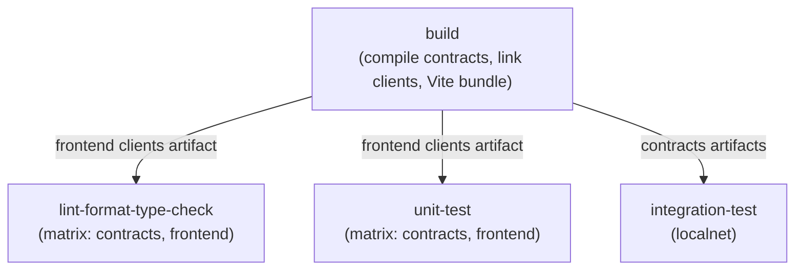

# CI

Design notes for the GitHub Actions setup. Implemented so far: a single
consolidated [`build-and-test`](.github/workflows/build-and-test.yml) workflow
plus a separate [`markdown-lint`](.github/workflows/markdown-lint.yml). This
documents the reasoning behind the split.

## Principles

- **Build once, share the output.** The generated contract artifacts (TEAL +
  ARC specs) and the frontend's linked typed clients are gitignored and
  regenerable. One `build` job produces them and uploads them as artifacts;
  downstream jobs download what they need instead of recompiling.
- **Split by prerequisites.** Lint/format/type-check and unit-test jobs need
  only Node.js, so they never install the heavier toolchain. The `build` job
  needs the AlgoKit CLI (Python) and no Docker; the `integration-test` job
  needs Docker. Keeping those in separate jobs (not separate workflows) keeps
  feedback fast and failures attributable to the right lane.
- **Parallel lanes per project.** `contracts` and `frontend` are independent
  npm projects; the per-project jobs run them side by side via a matrix.
- **CI calls the per-project npm scripts directly** (`npm run lint`, …), not
  `algokit project run`. The algokit wrapper is a local convenience and runs
  projects sequentially.

## Job graph

## What each job needs

| Job | Node.js | AlgoKit CLI | Docker | Artifacts it consumes |
| --- | --- | --- | --- | --- |
| `build` | ✅ | ✅ | — | — |
| `lint-format-type-check` | ✅ | — | — | frontend clients |
| `unit-test` | ✅ | — | — | frontend clients |
| `integration-test` | ✅ | ✅ | ✅ (algod + indexer) | contracts artifacts |
| `markdown-lint` (own workflow) | ✅ | — | — | — |

Key point: **lint/format/type-check, unit-test, and markdown are pure Node**.
`eslint`, `prettier`, `tsc`, `vitest`, and `markdownlint-cli2` need nothing
else — no Docker, no AlgoKit, no build.

## Why the frontend needs the build's output

The frontend imports the generated contract clients (`src/contracts/*`,
gitignored) from `lib/transaction.ts`. Those files only exist after
`algokit project link --all` (AlgoKit CLI). Both the frontend **type-check**
(`tsc` resolves the `CampaignClient` import) and the frontend **unit tests**
(Vite must resolve the same import at transform time) therefore require the
linked clients — so the build job uploads them once and the two consumer jobs
download them.

## Workflow: build-and-test

Implemented at `.github/workflows/build-and-test.yml`. Four jobs, with
`build` as the upstream dependency:

- **`build`** — installs Node + AlgoKit, compiles the contracts
  (`npm run build` → TEAL + clients), links the clients into the frontend
  (`algokit project link --all`), bundles the frontend (`npx vite build`), and
  uploads two artifacts: `contracts-artifacts` and `frontend-clients`.
- **`lint-format-type-check`** — matrix over `[contracts, frontend]`. The
  frontend lane downloads `frontend-clients` first, then each lane runs lint,
  format, and type-check. `fail-fast` is off so one project's failure doesn't
  cancel the other lane.
- **`unit-test`** — matrix over `[contracts, frontend]`. The frontend lane
  downloads `frontend-clients`, then each lane runs `npm run test:coverage`.
- **`integration-test`** — downloads `contracts-artifacts`, starts LocalNet,
  and runs the compiled TEAL against a live algod.

`npm run format` runs Prettier in `--check` mode, so it fails on style drift
without modifying files — the right behavior for CI.

## Workflow: markdown-lint (separate file)

Implemented at `.github/workflows/markdown-lint.yml`. Markdown linting gets its
**own workflow file**, because triggers live at the workflow level — a job
cannot have a different trigger than its workflow. Splitting it allows a
`paths:` filter so the markdown job only runs when docs (or the markdownlint
config) change.

This also gives markdown its own status check, so a docs failure isn't buried
under the per-project matrix. The lint command itself still checks *all*
`*.md` files — cheap, and the rules are repo-wide. (The job is ~30s, so it
could just as well run on every push; the `paths:` filter is about clean
semantics, not speed.)

## Testing taxonomy

The two projects have *different* test shapes:

| Part | Test layers | Why |
| --- | --- | --- |
| **Contracts** | Offline AVM tests (`contract.algo.spec.ts`) only | Contract code compiles to AVM bytecode and only executes inside the AVM. There is no way to unit-test a method in isolation — the offline AVM runtime *is* the contract's test layer. |
| **Frontend** | Unit (utils) + component (React + Testing Library) + optional E2E | Ordinary TypeScript/React, so the full pyramid applies. |

1. **Contract offline AVM tests** — full behavioral coverage (every method ×
   every branch), run under Node; no Docker. Coverage gate: 100%
   lines/branches/functions (see `docs/contracts/testing.md`).
2. **Frontend unit/component tests** — Vitest over components and utils,
   coverage ≥ 90% across components and utils (see `vitest.config.ts`).

The offline tests don't need the AlgoKit CLI or Docker because the
`algorand-typescript-testing` transformer runs the contract source directly
under Node. That's why the unit-test job is pure Node — it only consumes the
frontend clients artifact for import resolution, never the compiled TEAL.

## Caching — avoid redoing work every run

No custom Docker image is built or pulled for any job. Tooling is installed on
the runner and **cached**, which is simpler than maintaining a CI image:

- **Node** — `actions/setup-node@v7` with `cache: npm` and
  `cache-dependency-path` pointing at the project's `package-lock.json`. This
  caches `node_modules`, so `npm ci` is ~seconds on cache hits. (Two setup-node
  steps in `build`, one per project's lockfile.)
- **AlgoKit (Python)** — installed fresh via `pipx` in the `build` and
  `integration-test` jobs (not cached). The install is fast relative to the
  Docker container startup that dominates the integration job, and caching pipx
  correctly (venv *and* the `bin` symlinks) isn't worth the complexity.

The only Docker in CI is the **prebuilt** algod/indexer sandbox images, pulled
only by the `integration-test` job (not the hot path). If a custom CI image
ever becomes worth it (runner install time is the trigger), publish it once to
GHCR and rebuild only when its `Dockerfile` changes — but at this scale,
install-on-runner + cache is the right default.

## Artifacts — sharing build output between jobs

The `build` job uploads two artifacts that downstream jobs download, so nothing
is compiled twice:

- **`contracts-artifacts`** — `projects/contracts/smart_contracts/artifacts`
  (TEAL, ARC-32/56 specs). Consumed by `integration-test`.
- **`frontend-clients`** — `projects/frontend/src/contracts` (the linked typed
  clients). Consumed by `lint-format-type-check` (frontend lane) and
  `unit-test` (frontend lane).

Artifacts are the right tool here because the expensive step is Docker startup
in `integration-test`, not the compile itself; sharing the already-cheap
compile would be premature. The value is that the frontend's *two* consumer
jobs both get correct, freshly-generated clients without an AlgoKit install.
