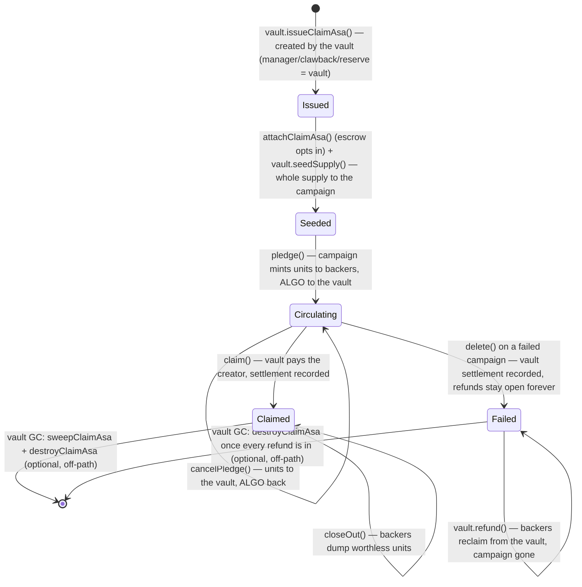

# Claim ASA redesign

> **Implemented.** The refund right is an on-chain asset balance: a per-campaign **Claim ASA**, issued by a permanent platform
> **ClaimsVault** that also holds all backers' pledged ALGO. The campaign escrow holds only the creator's storage deposit, so both
> settlement paths finalize in **O(1)** — including the failure path, where refunds keep working **from the vault forever, after the
> campaign is deleted**. Contract internals: [`campaign.md`](campaign.md) and the vault sources in
> `smart_contracts/claimsvault/`. Frontend: [`frontend.md`](frontend.md). Factory & catalog: [`architecture.md`](architecture.md).

## Why the Merkle design was replaced

The first design committed every pledge to a fanout-8 Merkle tree (root in global state, MMR frontier box, 1-bit-per-leaf spent-bitmap
shards). It worked, but it carried real costs:

1. **Proof machinery on both sides of the wire.** The contract verified `h × (fanout − 1)` sibling hashes per refund inside a 700-opcode
   budget (the reason the tree was fanout-8 at height 5 — a hard cap of 32,768 backers), and the frontend rebuilt the whole tree from the
   indexer before a backer could act.
2. **Capacity is a compile-time constant.** 8⁵ leaves, and every higher height costs opcode budget and shard MBR.
3. **The spent bitmap is dead weight on the success path.** A claimed campaign kept its frontier and shard boxes (≈ 2.30 ALGO MBR)
   around purely so `delete()` could enumerate them.
4. **Two sources of truth.** The contract kept `raised` and a bitmap; the truth about *who holds what* lived off-chain in the indexer.

The Claim ASA collapses all of that into one question the chain answers itself: **who holds how many claim units?**

## The idea: the refund right is an asset balance

Each campaign owns a Claim ASA with 1 claim unit = 1 microAlgo of live pledge:

- **Pledge** X µA → the campaign mints X claim units to the backer; the ALGO goes to the **vault** (the pooled refund escrow).
- **Cancel/refund** → the backer surrenders X units to the vault and receives X µA back.

The surrender is a real asset transfer out of the backer's balance. Once the units leave the backer's account, there is no second set of
units to redeem — **the ASA balance is the anti-double-refund mechanism**. No bitmap, no Merkle proof, no box, no local state.

The claim is a **bearer instrument**: freely transferable; whoever holds units at settlement time is entitled to the refund.

### Why transferable

On Algorand there is no way to make an ASA intrinsically non-transferable. The only "restriction" available is clawback arbitrage
(clawback address = some authority that un-transfers anything it dislikes), which needs an off-chain listener and can claw units out of
the hands of an innocent buyer — strictly more complexity, strictly more ways to lose money. Free transferability is both the simplest
model and the honest one: the contract's invariant is *holder-based*; it pays whoever surrenders the units. Transfer just moves the
entitlement, exactly like a paper claim receipt. No invariant depends on restricting transfers: a transferred claim cannot be
double-spent, a claim cannot be inflated (the supply is fixed at issuance), and the peg (`raised` ↔ outstanding units) is untouched by
transfers. The claim represents only the right to pull one's own microAlgos back out of a failed campaign, so bearer semantics don't
create an equity or security.

## The split: campaign escrow vs. refund vault

The second iteration of the design splits custody so that **backers are never on the creator's finalization path**:

- **Campaign escrow (app account):** only the creator's 0.2 ALGO storage deposit, plus the Claim ASA's seeded supply holding. No backer
  funds ever enter it.
- **ClaimsVault (permanent platform app):** all pledged ALGO, pooled across campaigns, plus each campaign's Claim ASA creation (the vault
  is the asset's creator, manager, clawback, and reserve).

This buys the property the original design lacked:

1. **Success path, O(1):** `claim()` has the vault pay the creator; `delete()` closes the escrow's holding back to the vault and the
   escrow to the creator — no supply check, no backer cooperation, even with worthless units still in backers' wallets.
2. **Failure path, O(1):** `delete()` on a failed campaign records the **failed settlement** in the vault, then closes the holding and the
   escrow. Backers refund **directly from the vault** — the settlement record plus the claim units are all the vault needs, forever, with
   the campaign gone. A straggler's money is never swept and never stranded.
3. **The vault pays by unit conservation, not bookkeeping.** The claim payout is derived as `total − vault holding − campaign holding`
   (exactly the live pledge total at claim time); refunds pay exactly the surrendered units; the pool is solvent by construction: each
   campaign's out-flows can never exceed its own in-flows.

## Lifecycle of a Claim ASA

## Minimum balances: who immobilizes what

| Item | Amount | Who pays | Recovered when |
| --- | --- | --- | --- |
| Escrow base + Claim ASA opt-in | 0.2 ALGO | Creator (`fund()` deposit) | `delete()` closes the escrow |
| Campaign app sponsorship floor | ≈ 0.47 ALGO | Creator (on their own account) | App deletion |
| Vault: created asset + mapping boxes per campaign | ≈ 0.166 ALGO | **Platform** (parked, accepted cost) | Optional GC: `destroyClaimAsa` once all units are home (or, for orphans, immediately) |
| Claim ASA opt-in | 0.1 ALGO | Each backer (their own account) | Opt-out / close-out (always possible; the asset never dies unexpectedly) |
| Factory registration box | ≈ 0.019 ALGO | Campaign creator (refundable) | `unregister()` |

The totals that matter:

- **Creator:** ≈ 0.67 ALGO per campaign, constant, **fully recoverable in O(1) on both paths** — the original success-path lock is gone.
- **Backer:** 0.1 ALGO opt-in, fully recoverable; a *disappeared* backer's own opt-in stays parked on their own account — self-owned,
  indistinguishable from any abandoned ASA opt-in on Algorand, and never required by anyone else.
- **Platform:** ≈ 0.156 ALGO per campaign parked on the vault (created-asset MBR + mapping boxes), backer-*independent*, recoverable only
  by optional garbage collection (`sweepClaimAsa` per holder after a claim, then `destroyClaimAsa`). This is the one explicitly accepted
  relaxation of the "nothing permanently locked" goal: it is constant per campaign, never blocks anything, and exists because Algorand's
  asset model requires *some* account to be an asset's creator and that account's MBR is freed only by destruction, which requires all
  units home.

## Pooled solvency: campaign A's funds can never pay campaign B

The vault holds every campaign's pledges in one account with **no per-campaign balance bookkeeping**. Isolation holds by conservation:

1. **Supply conservation:** `U_i + H_i + O_i = T` (vault + campaign + backers) — every unit lives in exactly one place.
2. **Mint backing:** `O_i = P_i − R_i` — every unit was minted exactly against a pledge payment verified into the vault
   (`pledge` asserts `payment.receiver == vault` *before* minting), and every cancel/refund consumes its own units.
3. **Payout attribution:** refunds pay exactly the surrendered units (AVM-enforced: you can't surrender units you don't hold); the claim
   pays `raised_i`, which equals the outstanding units (claimable campaigns have had zero refunds).
4. **Balance bookkeeping:** `V = Σᵢ (P_i − R_i − C_i) + S` — hence `R_i + C_i ≤ P_i` for every campaign.

The last payout trust point — the claim amount — is removed entirely: the vault **derives** it from unit conservation rather than
trusting the campaign's bookkeeping. Ordering attacks fail because each campaign's payouts are backed 1:1 by its own contributions.

## Security model

- **Authorities.** Manager + clawback on every issued ASA belong to the vault's app account, whose program is non-updatable (same router
  pattern as the Campaign). They are reachable only through audited methods: clawback only via `sweepClaimAsa`, gated on the recorded
  `CLAIMED` settlement. Pre-settlement the authority is inert; failed campaigns are unreachable by it; clawed units go only to the vault.
- **Payout gating.** `payBack`/`payClaim`/`settle` require the caller to be the campaign's own app account (matched against the mapping
  recorded at issuance), and the campaign program is hash-verified at the Factory and non-updatable — the campaign is the single audited
  driver of payouts.
- **Fake-vault inertness.** A creator storing a fake vault address makes the campaign inert: `attachClaimAsa` rejects any asset not
  created and managed by the stored vault, so no claim asset ever exists and `pledge()` refuses payments — no theft is possible.
- **Pooled custody (the honest new concentration).** All campaign funds sit in one vault account. Mitigations: a minimal, non-updatable,
  heavily-tested vault; no pause authority; per-campaign settlement records; and payout amounts derived from ledger state. A per-campaign
  vault would contain bugs but costs the creator the same parked MBR and adds an app per campaign — the pooled vault with derived amounts
  is the better trade.

## Known limitations & honest trade-offs

1. **≈0.166 ALGO per campaign parked on the vault** — the accepted, backer-independent platform cost (see the table above).
   `destroyClaimAsa` releases it once all units are home (failed campaigns self-complete as refunds return units; claimed campaigns need
   the optional permissionless `sweepClaimAsa` per holder, which is deliberately off any critical path). **Issuance is gated on Factory
   registration** and the destroy also covers **orphaned** ASAs (issued but never attached), so no abandoned lifecycle — registered or
   not — can permanently immobilize the vault's minimum balance.
2. **Pooled custody** — a vault bug would be systemic; no emergency authority exists.
3. **Bearer risk is the holder's** — losing the key loses the claim (the same risk as holding the ALGO itself).
4. **`raised` is revocable while Open** (cancelPledge decrements it) — the deadline remains the sole arbiter; the same accepted trade-off
   as before.
5. **A failed campaign's creator deposit waits for the last refund** — not because of a design flaw but because the backers' own ALGO
   (the escrow's purpose) is still pending; `delete()` deliberately refuses to sweep it. Once every refund is in, the deposit returns.
6. **ASA total is 2⁶⁴−1** at issuance — immutable, far above the ALGO supply, never binds.

## References

- [Asset Operations](https://developer.algorand.org/docs/get-details/asa/) — creation, reconfiguration, **deletion** ("all units must be
  held by the creator"), opt-in/out, clawback, freeze.
- [go-algorand ledger apply](https://github.com/algorand/go-algorand/blob/master/ledger/apply/asset.go) — the consensus-level asset rules
  (creator holds the supply at creation, destroy requires `creator holding == total`, clawback cannot close a holding, a creator cannot
  close its own holding).
- [Minimum Balance Requirement](https://developer.algorand.org/docs/get-details/accounts/#minimum-balance-requirement) — base +
  per-created-asset + per-opted-in-asset amounts.
