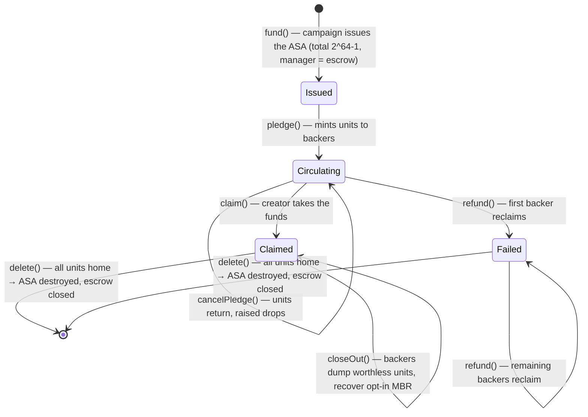

# Claim ASA redesign

> **Implemented.** Replaces the Merkle-tree + spent-bitmap refund machinery with a
> per-campaign **Claim ASA**: a backer's refund right is an on-chain asset balance,
> and surrendering units to the escrow is what makes a refund — or a double refund —
> real. Contract internals live in [`campaign.md`](campaign.md); this doc is the
> design rationale and the analysis of the five architectural requirements.
>
> Frontend design: [`frontend.md`](frontend.md). Factory & catalog:
> [`architecture.md`](architecture.md). Roadmap: [`roadmap.md`](roadmap.md).

## Why the Merkle design was replaced

The previous design committed every pledge to a fanout-8 Merkle tree (root in
global state, MMR frontier box, 1-bit-per-leaf spent-bitmap shards). It worked,
but it carried real costs:

1. **Proof machinery on both sides of the wire.** The contract verified
   `h × (fanout − 1)` sibling hashes per refund inside a 700-opcode budget
   (the reason the tree was fanout-8 at height 5 — a hard cap of 32,768
   backers), and the frontend rebuilt the whole tree from the indexer before a
   backer could act. That reconstruction is a per-campaign O(N) indexer scan.
2. **Capacity is a compile-time constant.** 8⁵ leaves, and every higher height
   costs opcode budget and shard MBR. Hundreds of thousands of backers were
   never on the table without a redesign.
3. **The spent bitmap is dead weight on the success path.** A claimed campaign
   keeps its frontier and shard boxes (and their ≈ 2.30 ALGO MBR) around purely
   so `delete()` can enumerate them. The anti-double-refund state has no
   economic meaning after settlement, yet it has to be deleted one shard at a
   time.
4. **Two sources of truth.** The contract keeps `raised` and a bitmap; the
   truth about *who holds what* lives off-chain in the indexer. Any drift
   between them is a bug class, not a bug.

The Claim ASA collapses all of that into one question the chain answers itself:
**who holds how many claim units?**

## The idea: the refund right is an asset balance

Each campaign owns a **Claim ASA** created by the campaign itself (via an inner
transaction in `fund()`, with the escrow as manager). One claim unit equals one
microAlgo of live pledge:

- **Pledge** X µA → the contract mints X claim units to the backer.
- **Cancel/refund** → the backer surrenders X units to the escrow and the
  contract pays X µA back.

The surrender is a real asset transfer out of the backer's balance. Once the
units leave the backer's account, there is no second set of units to redeem —
**the ASA balance is the anti-double-refund mechanism**. No bitmap, no Merkle
proof, no box, no local state. The ledger's own double-spend protection is the
nullifier.

The claim is a **bearer instrument**: it is freely transferable, and whoever
holds units at settlement time is entitled to the refund.

### Why transferable

On Algorand there is no way to make an ASA intrinsically non-transferable. The
only "restriction" available is clawback arbitrage (clawback address = some
authority that un-transfers anything it dislikes), which needs an off-chain
listener to even notice transfers and can claw units out of the hands of an
innocent buyer — strictly more complexity, strictly more ways to lose money.
Free transferability is therefore both the simplest model and the honest one:

- The contract's invariant is *holder-based*: it pays whoever surrenders the
  units. Transfer just moves the entitlement, exactly like a paper claim
  receipt.
- No invariant depends on restricting transfers. A transferred claim cannot be
  double-spent (the units still exist exactly once), a claim cannot be inflated
  (the supply is fixed at creation), and the escrow's ALGO ↔ outstanding-units
  equality (`raised`) is untouched by transfers.
- The claim is not an investment instrument: it represents only the right to
  pull your own microAlgos back out of a failed campaign, so bearer semantics
  don't create an equity or security.

## How the ledger states map to the requirements

| Requirement | Mechanism |
| --- | --- |
| **A — backers refund themselves** | `refund(axfer)` is permissionless: any holder presents an asset transfer of claim units to the escrow and receives the same number of µA. No platform, creator, or admin signature is involved. |
| **B — nothing stays locked** | Pledged ALGO: success → creator via `claim()`; failure → backers via `refund()`. Storage: the creator's 0.2 ALGO escrow deposit returns via `delete()`; the escrow's 0.2 ALGO MBR frees when the ASA is destroyed; a backer's 0.1 ALGO opt-in returns on close-out. |
| **C — no N-sized cleanup** | `delete()` is one call with two inner transactions (destroy ASA + close escrow), guarded by an asset-balance check the contract makes itself (`held == total`). The platform never iterates backers — refunds are pull-based by design. |
| **D — high capacity** | The campaign's own storage is a fixed set of global-state keys — zero boxes, zero per-backer records. Backer state lives in ASA balances on *backers'* accounts, which the protocol already scales. The only per-backer cost is the backer's own returnable 0.1 ALGO opt-in. |
| **E — the creator fronts a constant** | The creator funds exactly the escrow's fixed MBR (0.2 ALGO: base + created asset), recovered on delete. Nothing scales with the backer count. |

## Lifecycle of the Claim ASA

The terminal state is reached **without anyone enumerating holders**: a failed
campaign's backers refund (their money is in the escrow — a strong incentive);
a successful campaign's backers close out (their own 0.1 ALGO opt-in is the
incentive). When the last unit returns, the escrow's own balance equals the
total supply and `delete()` destroys the ASA and closes the account. If a
holder never acts, the ASA simply keeps existing — nothing is *lost*, and the
units stay redeemable or closeable forever, because the contract (not a
deleted app) remains the manager.

## Minimum balances: who immobilizes what

| Item | Amount | Who pays | Recovered when |
| --- | --- | --- | --- |
| Escrow base + Claim ASA (created asset) | 0.2 ALGO | Creator (`fund()` deposit) | `delete()` closes the escrow |
| Campaign app sponsorship floor (app base + global-state schema) | ≈ 0.47 ALGO | Creator (on their own account) | App deletion |
| Claim ASA opt-in | 0.1 ALGO | Each backer (their own account) | Close-out (failed: after refund; claimed: `closeOut()`) |
| Factory registration box | ≈ 0.019 ALGO | Campaign creator (refundable deposit) | `unregister()` at campaign delete |
| Factory app account (base + deposit headroom) | ≈ 1 ALGO, constant | Platform (deploy-time) | Never leaves the Factory |

The totals that matter:

- **Creator:** ≈ 0.67 ALGO of their own capital immobilized per campaign —
  constant regardless of backers, fully recoverable. (Merkle design: ≈ 0.47
  floor + up to 2.30 worst-case deposit — *worse* in the worst case.)
- **Backer:** 0.1 ALGO opt-in, fully recoverable, *per backer*. This is the
  one per-backer cost the design moved from the escrow to the backers — the
  price of putting the claim in the backer's wallet. (Merkle design: zero per
  backer, but the escrow's bitmap MBR grew with capacity instead.)
- **Platform:** 1 ALGO for the Factory, once. No per-backer or per-campaign
  storage on the platform at all.

Moving MBR to the backers is an explicit architectural decision, not a trick:
the total ALGO immobilized system-wide at 100k backers is ≈ 10,000 ALGO spread
across the backers' own wallets (each recovering their own 0.1 ALGO), versus
the Merkle design's ≈ 2.30 ALGO concentrated in the escrow plus a 32,768-backer
hard cap. For the D/E goals (capacity without creator capital), the ASA is the
better shape.

## Comparison with the previous designs

| | Box per backer | Merkle + bitmap | **Claim ASA** |
| --- | --- | --- | --- |
| Per-backer storage on the campaign | 1 box | 1 bit | **none** |
| Capacity bound | MBR (soft) | 8⁵ = 32,768 (hard) | **ASA supply / ALGO supply (no practical bound)** |
| Creator capital | grows with backers | 0.47 + up to 2.30 | **0.67, constant** |
| Backer capital | 0 | 0 | **0.1 (returnable opt-in)** |
| Refund | read box, delete, pay | verify proof + bitmap bit | **surrender units** |
| Double-refund defense | box deletion | spent bit | **the units are gone** |
| Frontend reconstruction | 1 box read | O(N) tree rebuild + proofs | **1 balance read** |
| Success-path residue | boxes block delete | frontier + shards block delete | **units held by backers block destroy (see below)** |

## Limitations & honest trade-offs

1. **Success-path cleanup waits on holders.** After `claim()` the units are
   worthless, but the ASA cannot be destroyed until every holder closes out
   (the protocol requires the creator to hold the full supply). Each backer's
   close-out reclaims their own 0.1 ALGO, so there is a natural incentive, but
   a single lazy (or dead) wallet keeps the ASA alive and the creator's 0.67
   ALGO parked. The failed path has no such weakness — refunding is strongly
   incentivized by the escrowed money itself. This is the main regression
   versus the Merkle design (where `delete()` after `claim()` was immediate)
   and the main open question: a clawback- or bounty-based force-close would
   restore it at the cost of O(N) work by *someone*.
2. **0.1 ALGO per backer.** Bearing claims costs backers a returnable opt-in.
   At ALGO prices that is a rounding error, but it is a per-user cost the
   Merkle design didn't have.
3. **Bearer risk is the holder's.** Losing the key, or transferring units to
   the wrong address, loses the claim — the same risk as holding the ALGO
   itself.
4. **The 1:1 peg is protocol-enforced, not contract-enforced.** Nothing in the
   contract can *mint* extra units (only the app account holds the supply) or
   pay out without receiving units, so the peg holds by construction.
5. **`raised` remains a live, revocable number while Open** (cancelPledge
   decrements it). A large backer can still fake near-goal progress and
   withdraw before the deadline — the same accepted trade-off as the Merkle
   design; the deadline is the sole arbiter.
6. **ASA total is 2⁶⁴−1 at creation.** Immutable, so the cap is fixed at
   deploy; it is far above the ALGO total supply (~10¹⁶ µA), so it can never
   bind.

## References

- [Asset Operations](https://developer.algorand.org/docs/get-details/asa/) —
  creation, reconfiguration, **deletion** ("all units must be held by the
  creator"), opt-in/out, clawback, freeze.
- [go-algorand ledger apply](https://github.com/algorand/go-algorand/blob/master/ledger/apply/asset.go) —
  the consensus-level asset rules this design relies on (creator holds the
  supply at creation, destroy requires `creator holding == total`).
- [Minimum Balance Requirement](https://developer.algorand.org/docs/get-details/accounts/#minimum-balance-requirement) —
  base + per-created-asset + per-opted-in-asset amounts.
