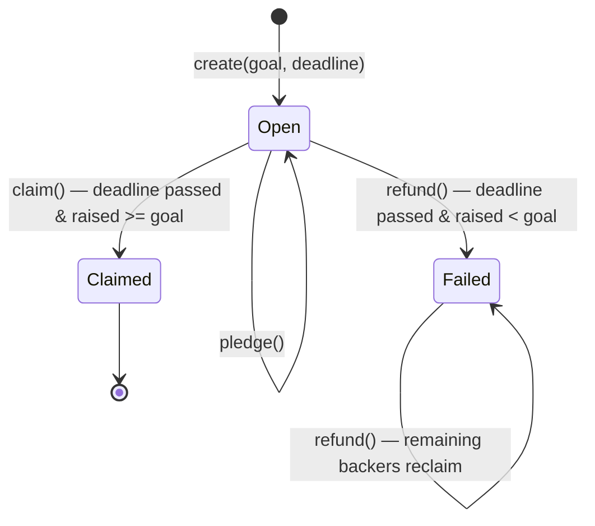

# Campaign contract

The `Campaign` contract (`smart_contracts/campaign/contract.algo.ts`) is the core of
AlgorArt: a non-custodial crowdfunding escrow. One stateful application per campaign.

Source of truth is the Algorand chain. The contract — not a server — holds pledged ALGO
and enforces the campaign rules.

## State

### Global state

| Key | Type | Meaning |
|---|---|---|
| `creator` | `Account` | Campaign creator; the only account allowed to `claim()` |
| `goal` | `uint64` | Funding target, in microAlgos |
| `deadline` | `uint64` | UNIX timestamp (seconds) after which the outcome is decided |
| `raised` | `uint64` | Total microAlgos pledged so far |
| `status` | `uint64` | `0` Open, `1` Failed, `2` Claimed |

### Boxes

| Map | Key | Value | Meaning |
|---|---|---|---|
| `pledges` | backer address | `uint64` | That backer's pledged microAlgos |

## State machine

## Methods & guards

### `create(goal, deadline)`

- `@abimethod({ onCreate: 'require' })` — only runs in the app-create transaction.
- Guards: must be app-create (`applicationId == 0`), `goal > 0`, deadline in the future.
- Sets `creator`, `goal`, `deadline`, `raised = 0`, `status = Open`.

### `pledge(payment)`

- Takes a `gtxn.PaymentTxn` — the caller submits this app call in a group with a payment
  from their own account to the app's escrow address.
- Guards:
  - before the deadline (`Global.latestTimestamp < deadline`)
  - `payment.receiver == Global.currentApplicationAddress` (escrow)
  - `payment.sender == Txn.sender` (payer is the caller)
  - `payment.amount > 0`
- Adds `payment.amount` to the backer's box and to `raised`.
- **Re-pledging is allowed** — each payment is added to the existing box total.

### `claim()`

- Creator only (`Txn.sender == creator`), after the deadline, and `raised >= goal`.
- Guards: `status == Open` (prevents double payout).
- Sets `status = Claimed`, then pays the entire escrow balance to the creator.

### `refund()`

- Any backer, after the deadline, and `raised < goal`.
- Materialises `status = Failed` on the first refund; subsequent calls require it.
- Guard: the caller's pledge box must exist (prevents refunding twice or refunding non-backers).
- Deletes the box and pays the box amount back to the caller.

## Design decisions

1. **`Funded` is a derived state.** There is no separate `settle()` call, so
   `claim()`/`refund()` evaluate the deadline and goal directly. `Funded` is never
   materialised into global state; only `Open`, `Failed`, and `Claimed` are stored.
2. **Escrow payout is `balance − minBalance`.** The app account must keep its minimum
   balance to remain alive, so the contract only ever pays out the spendable amount.
3. **First pledge uses `Box.get({ default: 0 })`.** Reading a missing box's `.value` would
   fail the transaction, so the first pledge defaults to 0.
4. **Re-pledging accumulates.** A backer's box holds the running total of all their
   payments; no separate pledge counter.
5. **Refund deletes the box after reading it.** This makes a second refund impossible
   (box no longer exists) and is safe because the payment is issued in the same transaction.
6. **`claim()` guards against re-entrancy/replay** with the `already claimed` status check.

## Frontend integration (Phase 2)

The generated client (`CampaignClient.ts`) exposes each method with typed args. The
`pledge` call must be built as a transaction group: a payment from the backer to
`Global.currentApplicationAddress`, passed as the ABI `pay` argument alongside the app call.

## Testing

Full behavioral matrix lives in `contract.spec.ts` (simulator) — every method × every
branch (caller checks, deadline checks, goal checks, re-pledge, double-claim,
double-refund).
