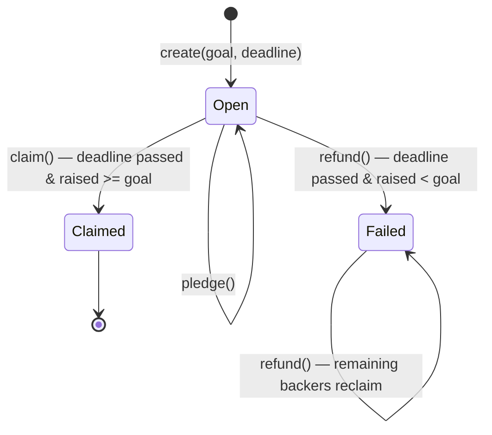

# Campaign contract

The `Campaign` contract (`smart_contracts/campaign/contract.algo.ts`) is the core of
AlgorArt: a non-custodial crowdfunding escrow. One stateful application per campaign.

Source of truth is the Algorand chain. The contract — not a server — holds pledged ALGO
and enforces the campaign rules.

## State

### Global state

| Key | Type | Meaning |
| --- | --- | --- |
| `creator` | `Account` | Campaign creator; the only account allowed to `claim()` |
| `goal` | `uint64` | Funding target, in microAlgos |
| `deadline` | `uint64` | UNIX timestamp (seconds) after which the outcome is decided |
| `raised` | `uint64` | Total microAlgos pledged so far |
| `status` | `uint64` | `0` Open, `1` Failed, `2` Claimed |

### Boxes

| Map | Key | Value | Meaning |
| --- | --- | --- | --- |
| `pledges` | backer address | `uint64` | That backer's pledged microAlgos |

## State machine



## Methods & guards

### `create(goal, deadline)`

- `@abimethod({ onCreate: 'require' })` — only runs in the app-create transaction.
- Guards: must be app-create (`applicationId == 0`), `goal > 0`, deadline in the future.
- Sets `creator`, `goal`, `deadline`, `raised = 0`, `status = Open`.

### `pledge(payment)`

- Takes a `gtxn.PaymentTxn` — the caller submits this app call in a group with a payment
  from their own account to the app's escrow address.
- Guards:
  - before the deadline (`Global.latestTimestamp < deadline`)
  - `payment.receiver == Global.currentApplicationAddress` (escrow)
  - `payment.sender == Txn.sender` (payer is the caller)
  - `payment.amount > 0`
- Adds `payment.amount` to the backer's box and to `raised`.
- **Re-pledging is allowed** — each payment is added to the existing box total.

### `claim()`

- Creator only (`Txn.sender == creator`), after the deadline, and `raised >= goal`.
- Guards: `status == Open` (prevents double payout).
- Sets `status = Claimed`, then pays the entire escrow balance to the creator.

### `refund()`

- Any backer, after the deadline, and `raised < goal`.
- Materialises `status = Failed` on the first refund; subsequent calls require it.
- Guard: the caller's pledge box must exist (prevents refunding twice or refunding non-backers).
- Deletes the box and pays the box amount back to the caller.

## Design decisions

1. **`Funded` is a derived state.** There is no separate `settle()` call, so
   `claim()`/`refund()` evaluate the deadline and goal directly. `Funded` is never
   materialised into global state; only `Open`, `Failed`, and `Claimed` are stored.
2. **Escrow payout is `balance − minBalance`.** The app account must keep its minimum
   balance to remain alive, so the contract only ever pays out the spendable amount.
3. **First pledge uses `Box.get({ default: 0 })`.** Reading a missing box's `.value` would
   fail the transaction, so the first pledge defaults to 0.
4. **Re-pledging accumulates.** A backer's box holds the running total of all their
   payments; no separate pledge counter.
5. **Refund deletes the box after reading it.** This makes a second refund impossible
   (box no longer exists) and is safe because the payment is issued in the same transaction.
6. **`claim()` guards against re-entrancy/replay** with the `already claimed` status check.

## Frontend integration (Phase 2)

The generated client (`CampaignClient.ts`) exposes each method with typed args. The
`pledge` call must be built as a transaction group: a payment from the backer to
`Global.currentApplicationAddress`, passed as the ABI `pay` argument alongside the app call.

> The complete UI design (pages, data flow, call patterns) lives in
> [`docs/frontend.md`](../frontend.md). This section is the *API* view: how each
> method maps to a generated-client call, how the indexer surfaces state, and the
> gotchas discovered while tracing the client's actual behavior.

### Reading state — indexer model

The frontend is a read model over the indexer. Each campaign is an `Application`
whose `params.global-state` is a list of `{ key, value }` pairs:

| Contract key | Global-state `value.type` | Decode as |
| --- | --- | --- |
| `creator` | `1` (bytes) | 32-byte address |
| `goal` | `2` (uint) | microAlgos |
| `deadline` | `2` (uint) | UNIX seconds |
| `raised` | `2` (uint) | microAlgos |
| `status` | `2` (uint) | `0` Open, `1` Failed, `2` Claimed |

The indexer keys are **base64 of the UTF-8 key name** (`Z29hbA==` → `goal`, etc.);
decode the key, don't match on base64 directly. `Funded` is not stored — the UI
recomputes it from `deadline`/`raised`/`goal` (same rule the contract evaluates).

Backer pledges are **boxes**, not global state: fetch them with
`indexer.searchForApplicationBoxes(appId)`. A box name is the `p` prefix +
address bytes; a missing box means the backer has not pledged (or already refunded).

### Generated client — call surface

`CampaignClient` (and `CampaignFactory` for deploy) are generated from
`Campaign.arc56.json`. Key facts about the surface:

- **Deploy** uses `CampaignFactory.send.create.create({ args: { goal, deadline } })`
  and returns `{ appClient, result }`; `result.appId` / `result.appAddress`
  identify the new campaign.
- **Methods** are reached three ways: `client.send.<m>()` (sign + submit),
  `client.createTransaction.<m>()` (build a txn to compose), and
  `client.newGroup().<m>()` (an atomic composer). The dApp uses `client.send.*`.
- **Signer/sender are per-call.** Construct the client with
  `{ algorand, appId, defaultSender: activeAddress, defaultSigner: transactionSigner }`
  so the wallet signs; reads (`client.state.*`) need neither.
- **Typed args** (`CampaignArgs['obj']`) accept object form, e.g.
  `{ goal, deadline }` for `create`, `{ payment }` for `pledge`.

### Method → call cheat sheet

```ts
// create — deploy a new campaign (app-create txn)
factory.send.create.create({ args: { goal: goalMicroAlgos, deadline: deadlineUnixSeconds } })

// pledge — the ABI `pay` arg must be a payment txn in the SAME group
client.send.pledge({
  args: {
    payment: await algorand.createTransaction.payment({
      sender: activeAddress,
      receiver: client.appAddress,           // == Global.currentApplicationAddress
      amount: microAlgos(pledgeAmount),
    }),
  },
})

// claim / refund — no args
client.send.claim()
client.send.refund()
```

### Gotchas (learned tracing the client)

- **`pledge` is a two-txn atomic group.** The client adds the payment to the
  composer and passes it as the ABI `pay` argument; the contract then re-checks
  `sender === caller`, `receiver === escrow`, `amount > 0`. Never send the
  payment separately — a standalone payment would bypass the box bookkeeping.
- **Inner payments need fee cover.** `claim`/`refund` issue an inner payment, so
  the outer app-call fee must cover it. Pass
  `coverAppCallInnerTransactionFees: true` in the send params (or add an
  explicit `extraFee`).
- **Box references are auto-populated** (`populateAppCallResources` defaults to
  true), so `pledge`/`refund` don't need manual box arrays.
- **`defaultSender` + `defaultSigner` are required for writes.** Without them the
  client has no sender/signer and the wallet never sees the transaction.
- **Units.** On-chain values are microAlgos (`bigint`); `AlgoAmount`
  (`algo(n)`, `microAlgos(n)`) converts. `deadline` is seconds, not ms.
- **`client.appAddress`** is the escrow address — the receiver for pledges.

## Testing

A full behavioral matrix lives in `contract.algo.spec.ts` — every method × every
branch (caller checks, deadline checks, goal checks, re-pledge, double-claim,
double-refund). Tests run offline via `algorand-typescript-testing` + Vitest.

A LocalNet integration suite in `contract.integration.test.ts` deploys the compiled
TEAL and exercises the full lifecycle (create → pledge → claim, and → refund).

See [`testing.md`](testing.md) for the tooling setup, API cheat sheet, coverage
matrix, and integration notes.
